# MetBench v2 架构图与类图

> 用 Mermaid 渲染。在 GitHub / VS Code Markdown Preview / mermaid.live 都可直接渲染。
> 配套文档：[`v2-system-mt-architecture.md`](v2-system-mt-architecture.md) +
> [`entity-model.md`](entity-model.md) + [`glossary.md`](glossary.md)。

---

## 1. 整体架构图（部署层视图）

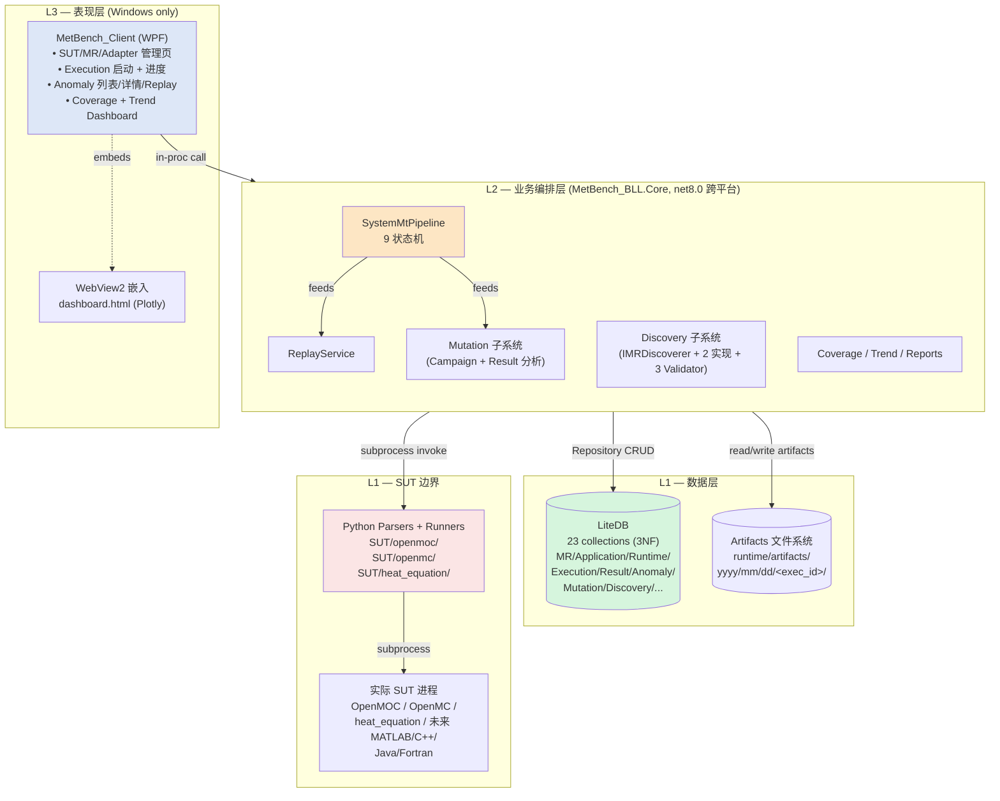

---

## 2. 模块清单（C# Namespace 视图）

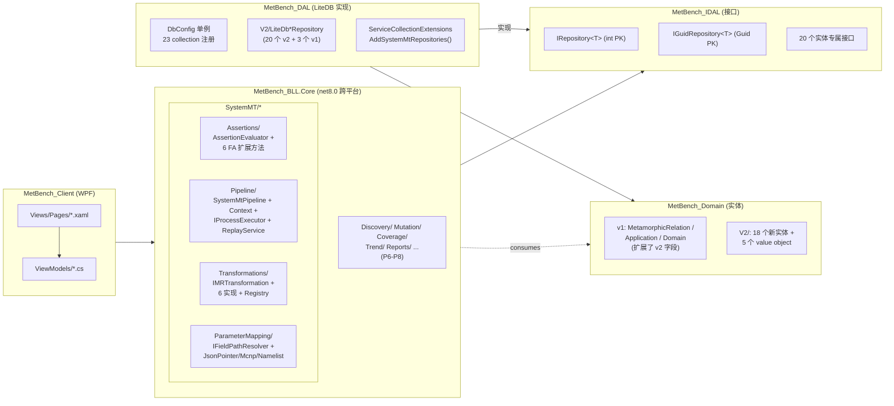

---

## 3. ER 图 — LiteDB 实体关系总览

> 23 collection 之间的外键关系（实线 = 强 FK；虚线 = 可空 FK）。

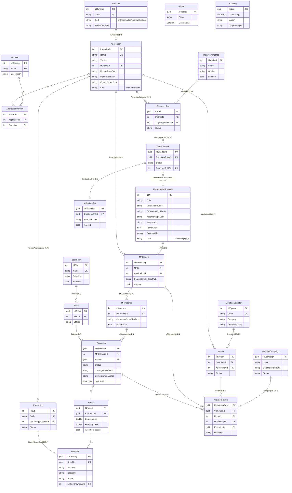

---

## 4. 类图 — 核心实体（4 级 MR 语义层次 + 执行链）

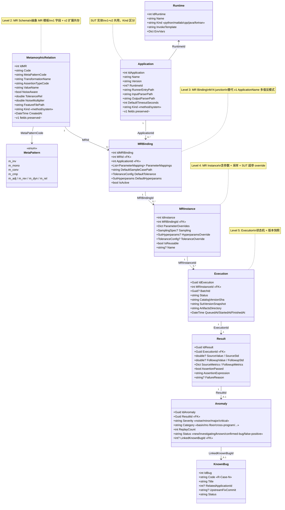

---

## 5. 类图 — Adapter 概念分解（重要）

> v2 设计里**没有单独的 Adapter 实体**。"Adapter" 的职责被显式拆解到 3 个独立位置：

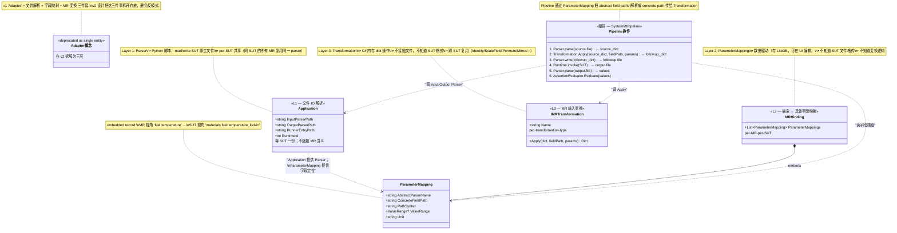

**为什么不要单独 Adapter 实体**：

| 反模式（v1 风格） | v2 设计 |
|---------------|--------|
| `Adapter` 同时承担 read/write + 字段映射 + MR 变换 | 三件事分离到 3 层 |
| 每个 (SUT × MR) 一个 adapter .py 文件 | Parser 仅按 SUT 一份；MR 变换是 C# |
| `openmoc_input_adapter_fuel_temperature.py` (~50 行) | `openmoc_input_parser.py` (~20 行通用) + `ScaleField` C# (复用全部 m_mono MR) |
| 加新 MR 加 1 新 .py 文件 | 加新 MR 加 1 行 ParameterMapping JSON |

详见 [`glossary.md`](glossary.md) §2 与 [`v2-system-mt-architecture.md`](v2-system-mt-architecture.md) §3.2。

---

## 6. 类图 — 值对象 (Value Objects，嵌入式)

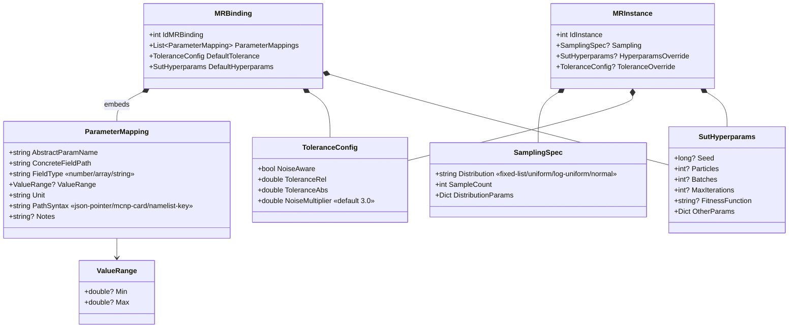

---

## 7. 类图 — Repository 模式（CRUD 层）

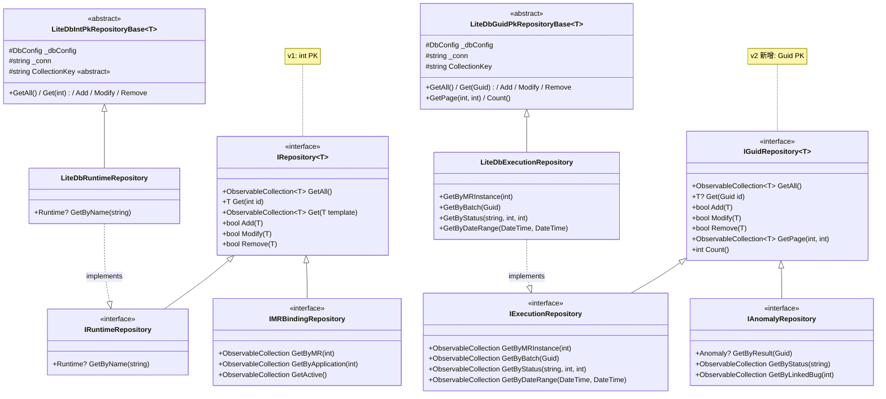

---

## 8. 类图 — Pipeline 子系统（MT 编排核心）

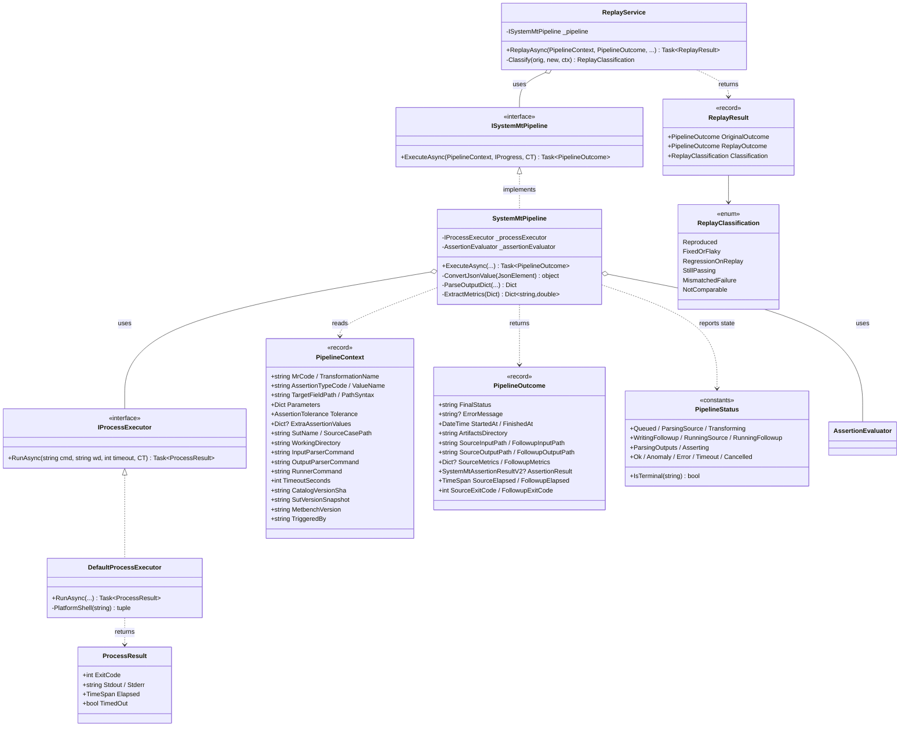

---

## 9. 类图 — 断言子系统（FluentAssertions 扩展）

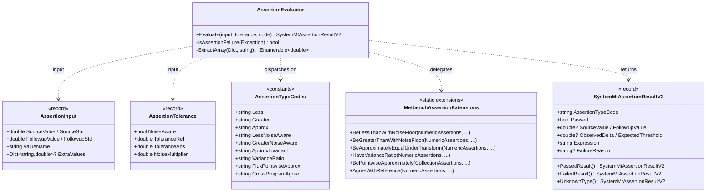

---

## 10. 类图 — Transformation 子系统（MR 输入变换）

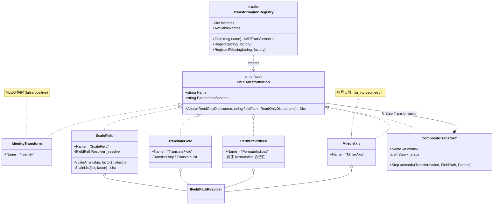

---

## 11. 类图 — ParameterMapping 子系统（路径解析）

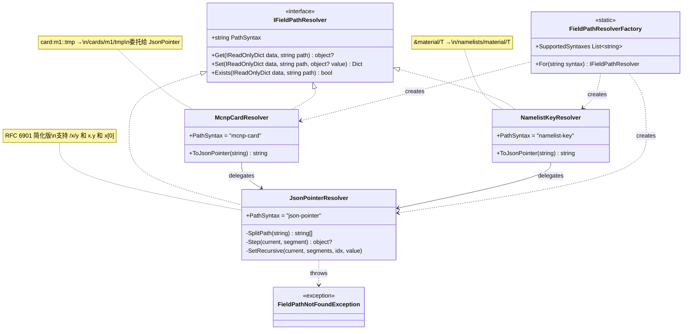

---

## 12. 类图 — Discovery 子系统（MR 识别工作流）

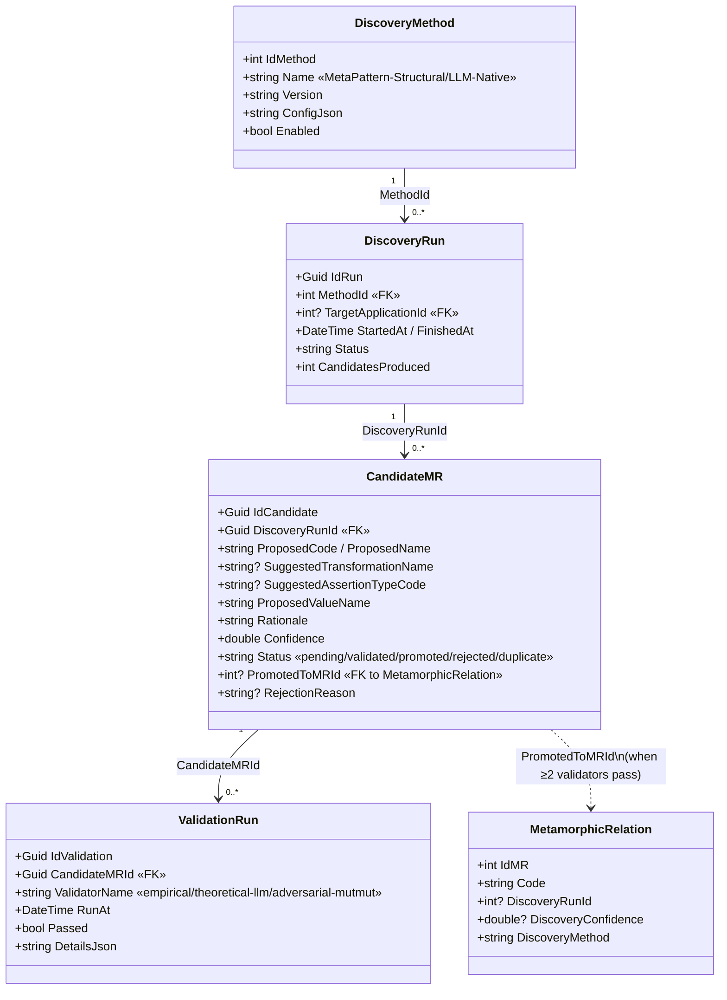

---

## 13. 类图 — Mutation 子系统（变异分析）

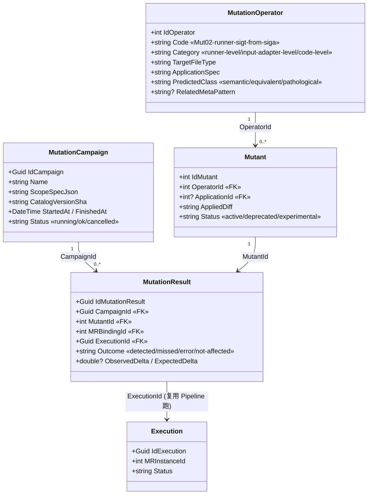

---

## 14. MT Pipeline 数据流（顺序图）

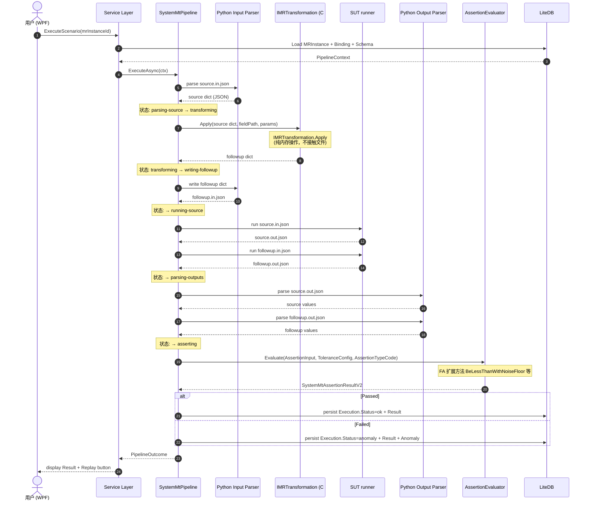

---

## 15. .feature ↔ LiteDB 双向同步流程图

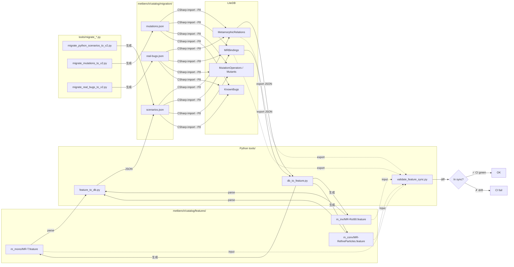

---

## 16. 4 级 MR 语义层次（概念视图）

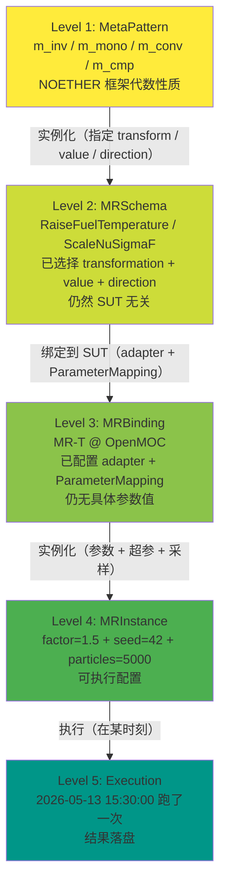

---

## 17. v1 ↔ v2 实体演化对照

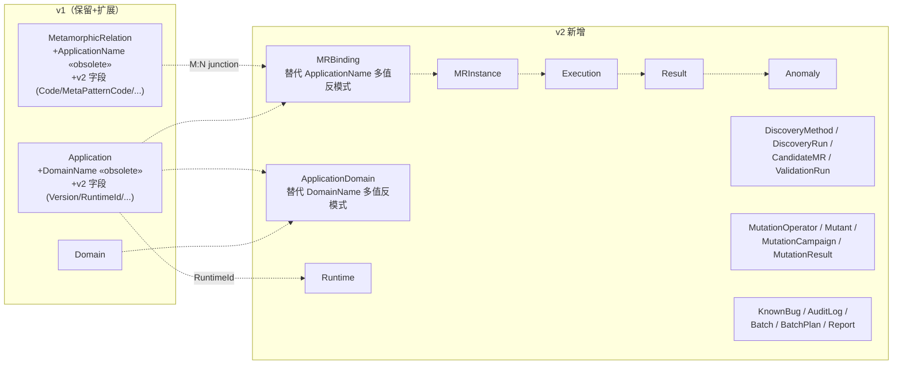

---

## 参考链接

| 文档 | 用途 |
|------|------|
| [`v2-system-mt-architecture.md`](v2-system-mt-architecture.md) | 整体架构 + 模块清单 + Pipeline 状态机 |
| [`glossary.md`](glossary.md) | 术语表（4 级 MR 语义） |
| [`entity-model.md`](entity-model.md) | 23 collection 完整 schema |
| [`assertion-extensions.md`](assertion-extensions.md) | FA 扩展方法 API |
| [`migration-plan.md`](migration-plan.md) | 8 周路线 + 迁移脚本 |
| [`evolution.md`](evolution.md) | v1.0 → v2 演化纪实 |
