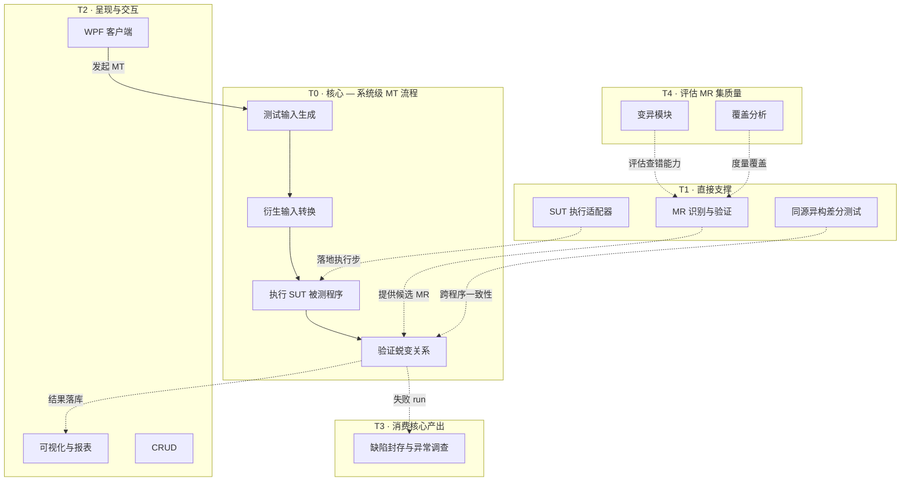
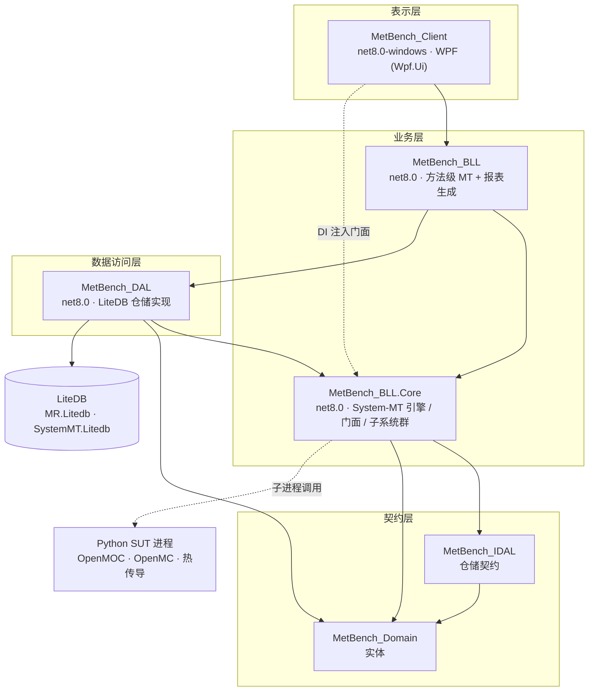
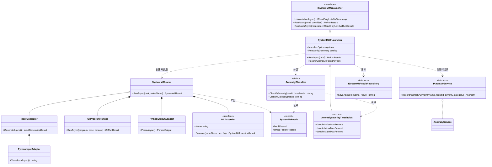
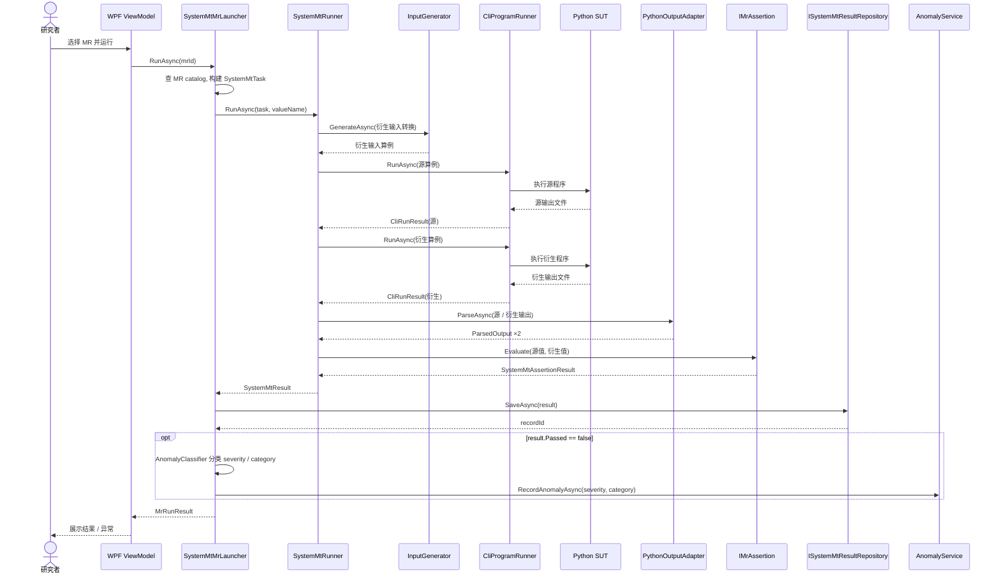

# MetBench 图集 — 功能 / 架构 / 类 / 时序

> 用 Mermaid 绘制。功能图依据 [`CLAUDE.md`](../CLAUDE.md) §2 的 T0–T4 分层；
> 架构/类/时序图依据当前项目结构与 `MetBench_BLL.Core/SystemMT` 实际代码。
> 图为概念快照，随代码演进需同步更新。

---

## 1. 功能图

T0 为核心 MT 流程；T1–T4 为围绕核心的功能层。

---

## 2. 架构图

6 个工程分 4 层；箭头为编译期工程引用（`Domain` 为叶子）。WPF 经门面
`ISystemMtMrLauncher` 使用 System-MT；引擎以子进程调用 Python SUT。

---

## 3. 类图

System-MT 运行时核心协作 —— 门面、引擎、适配器、结果记录与异常分类。

---

## 4. 时序图

一次 `RunAsync(mrId)` 的完整调用 —— 源运行 → 衍生运行 → 解析 → 断言 →
落库 → 失败则记异常。

