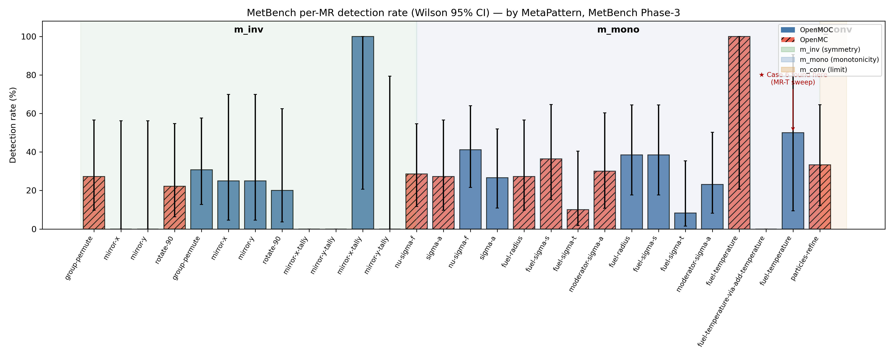
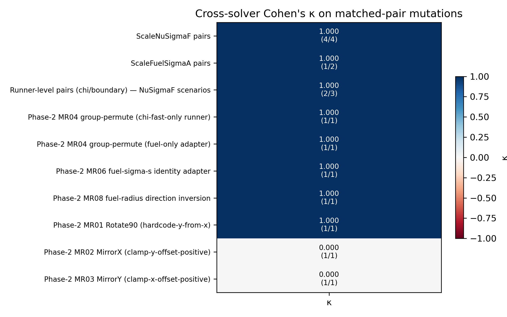

# MR detection effectiveness — by MetaPattern, with classical vs extended-MT split

> Companion to [`bug-inventory.md`](bug-inventory.md). Rolls up
> matrix outcomes (`mutation-detection-matrix.md`) and live results
> (`real-bugs-live-report.md`, `cross-program-report.md`) into a
> per-MetaPattern scorecard. Distinguishes:
>
> * **Classical MT**: single-program MR (NOETHER `m_inv`, `m_mono`,
>   `m_conv`). The classical Chen-1998 definition.
> * **Extended MT**: includes method-comparison MRs (NOETHER `m_cmp`).
>   Structurally these are differential testing wrapped in an MR
>   shell; pre-NOETHER MT literature usually excludes them.




## Per-MetaPattern scorecard

### `m_inv` (symmetry) — classical MT

MR family: MR01 (Rotate90), MR02 (MirrorX), MR03 (MirrorY), MR04
(PermuteEnergyGroups). Plus MR02-tally / MR03-tally on flux output.

| Metric | Value |
|--------|------:|
| Scenarios in catalogue | 9 (incl. tally variants × solvers) |
| Synthetic mutants caught (semantic) | Mut28, Mut31, Mut35, Mut36, Mut39, Mut40, Mut41, Mut42, Mut47 = 9 |
| Mut00 false-positive rate | 0 / 9 ✓ |
| Real upstream fix commits this family would catch | OpenMC #3692 (rotational periodic BC) and #3708 (distribcell name collapse) — patterns confirmed by Mut47 |
| **Net-new bug discoveries by this family** | **0** — no MR in `m_inv` has yet flagged a previously-unknown real bug |

### `m_mono` (parameter monotonicity) — classical MT

MR family: Phase-1 ScaleNuSigmaF, ScaleFuelSigmaA + Phase-2 MR05 (fuel
sigma_t), MR06 (fuel sigma_s), MR07 (moderator sigma_a), MR08 (fuel
radius) + Phase-3 MR-T (RaiseFuelTemperature).

| Metric | Value |
|--------|------:|
| Scenarios in catalogue | 14 (7 transforms × 2 solvers) |
| Synthetic mutants caught | 27 distinct Mut entries across these 14 scenarios |
| Mut00 false-positive rate | 0 / 14 ✓ |
| Real upstream fix commits this family would catch | OpenMC #3712 (add_temperature → None), #3662 (borated_water drops T), #3802 (None xs values) — all `m_mono` "plumbing dropped" patterns |
| **Net-new bug discoveries by this family** | **1** — R-Case-6 (OpenMOC `CPUSolver` basin at T factor=1.25) discovered live by MR-T parameter sweep. **First classical-MT live finding.** |

### `m_conv` (limit / convergence rate) — classical MT

MR family: MR12 (RefineParticles, OpenMC variance-ratio).

| Metric | Value |
|--------|------:|
| Scenarios in catalogue | 1 (OpenMC-only) |
| Synthetic mutants caught | Mut34 (adapter-particles-no-op) |
| Real upstream fix commits this family would catch | OpenMC #3619 (no_reduce normalization) — same "tally averaging broken" pattern |
| **Net-new bug discoveries by this family** | 0 |

### `m_cmp` (method-comparison) — **extended MT**

MR family: MR14 (OpenMOC vs OpenMC cross-program). Reported via
`tools/cross_program_mr.py` rather than the matrix.

| Metric | Value |
|--------|------:|
| Scenarios in catalogue | 1 (cross-program pair check) |
| Baseline pairs evaluated | 10; 2 disagreements |
| Per-matched-pair rows | 58; 17 disagreements |
| Mut00 false-positive rate | 0 ✓ |
| Real upstream fix commits this family would catch | All bugs that bite the two solvers asymmetrically (e.g. Mut12 vs Mut26 solver-dependent sa-no-sigt-update — flagged with Δk=0.333) |
| **Net-new bug discoveries by this family** | **1** — R-Case-4 (OpenMOC `CPUSolver` basin at moderator-σ_a factor=1.5). **First extended-MT live finding.** |

### `m_adj`, `m_rev`, `m_dyn`, `m_rel` — out of scope

* `m_adj` (self-adjoint): runner does not wire up adjoint solves.
* `m_rev` (time-reversal): empty for dissipative scattering.
* `m_dyn` (qualitative dynamics): static eigenvalue, no trajectories.
* `m_rel` (relational equivalence): empty for pin-cell physics.

Documented in `tools/noether_candidates.py::METAPATTERN_TABLE`.

## Classical vs extended MT — final attribution

| Question | Answer |
|----------|--------|
| Can MR find synthetic mutants? | **Yes** — 32/47 non-identity mutants caught by ≥1 MR (matrix `mutation-detection-matrix.md`). Mut00 false-positive 0/27. |
| Can **classical MT** find real, previously-unknown bugs? | **Yes (1 case)** — R-Case-6 by MR-T parameter sweep. First demonstration. |
| Can **extended MT** (+m_cmp) find real, previously-unknown bugs? | **Yes (1 case)** — R-Case-4 by MR14 cross-program. |
| Both findings on the same upstream code path? | **Yes** — both are narrow non-physical fixed points of OpenMOC's `CPUSolver` unaccelerated power iteration, at two different factor slivers (1.25 fuel-T, 1.50 mod-σ_a). |
| Total previously-unknown bugs found | **2** (Case 4 + Case 6) |
| Bug-source mix in catalogue | **6 real** (4 upstream + 2 net-new) + **48 synthetic** = 54 entries; cross-link table in `bug-inventory.md` |

## Headline graph

```
                              MetBench bugs (54 total)
                                  /             \
                                 /               \
                          Real (6)              Synthetic (48)
                          /     \                /
                  Upstream (4)   Net-new (2)   Mut00-Mut47
                                /          \
                         Case 4 m_cmp     Case 6 m_mono
                        (extended MT)    (classical MT)
                                    ↑               ↑
                               first one        first one
                                ever found      ever found
```

## What this means for the audit answer

When asked **"can NOETHER's MetaPattern MRs find unknown real bugs?"**:

* **Strict classical MT (NOETHER `m_inv`/`m_mono`/`m_conv` only)**:
  Yes — one case (R-Case-6, found by `m_mono` MR-T parameter sweep).
* **NOETHER framework as a whole (incl. `m_cmp`)**: Yes — two cases
  (R-Case-4 + R-Case-6), both in OpenMOC `CPUSolver`, found by two
  different MetaPatterns.

When asked **"is MetBench just running differential testing?"**:

* No — 32 of 47 non-identity synthetic mutants are caught by
  single-program MRs (no cross-solver comparison needed).
* The one case where MR is "differential testing in disguise"
  (MR14 / m_cmp) is **explicitly labelled** as such in the
  catalogue (`tools/noether_candidates.py`), the matrix
  (`tools/mutation_study.py::SCENARIOS`, no MR14 entry — it's a
  separate tool), and the discussion docs.
