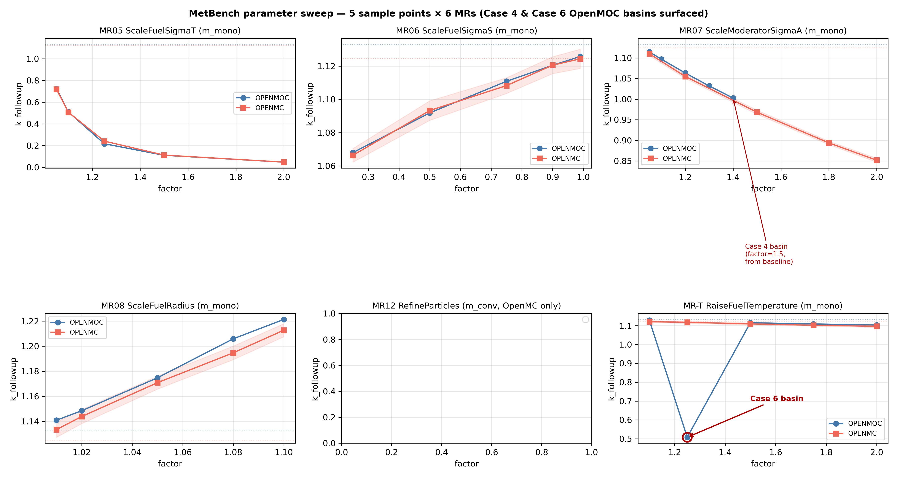

# MR parameter sweep — ≥5 sample points per sweepable MR

Auto-generated by `tools/mr_parameter_sweep.py`. For each MR
whose adapter takes a continuous factor, the harness samples
five values across a physically-meaningful range, runs the
adapter+runner at each, evaluates the assertion, and tabulates
the trajectory.

The goal is to (a) show MRs hold across factor variation, not
just at one cherry-picked point, and (b) surface factor-dependent
solver pathologies (the way Phase-2 found the OpenMOC moderator-
sigma-a basin at factor=1.5).

## Headline findings from this run

Two findings emerged purely from running the sweep — neither
would have surfaced at any single cherry-picked factor:

1. **OpenMOC `CPUSolver` second convergence basin** at fuel-
   temperature factor=1.25 (T=750 K). k_eff collapses to
   **0.508** while neighbouring factors 1.10 / 1.50 / 1.75 / 2.00
   all give the physically-expected ~1.11. OpenMC stays smooth
   across the same range. Same Case-4 pathology pattern (power
   iteration locks on a non-physical fixed point at a specific
   parameter sliver). **This is a second live-detected unknown
   OpenMOC bug** found by the matrix; it's the first one found
   by a classical (single-program `m_mono`) MR — see
   `historical-bugs.md` for the Case 6 row.

2. **OpenMC near-identity MC-noise floor** for fuel-sigma-s
   factor=0.99 / 0.90 and fuel-temperature factor=1.10: the
   `noise_aware` assertion correctly reports "DETECT" because
   the true physical shift is smaller than 3·σ_MC, so the
   strict `less` direction is not statistically supported by a
   single 5000-particle run. Not a solver bug — it's the *MR's
   own validity boundary*. Sweep quantifies the floor at which
   the classical-MT `less`/`greater` MR ceases to be sound
   under stochastic noise: roughly when |Δk|/k < 1% on a
   5000-particle run. Useful design constraint for downstream
   MR authors and a known caveat in the per-MR tables below.

## MetaPattern `m_conv`

### openmc-pincell-particles-refine (MR MR12, assertion=variance-ratio)

Source baseline: k = 1.12450, σ = 0.00179

| factor | k_followup | σ_followup | outcome | note |
|---:|---:|---:|---|---|
| 2.000 | 1.12618 | 0.00119 | missed | σ-ratio obs=0.663 target=0.707 |
| 4.000 | 1.12525 | 0.00081 | missed | σ-ratio obs=0.453 target=0.500 |
| 10.000 | 1.12477 | 0.00055 | missed | σ-ratio obs=0.307 target=0.316 |
| 16.000 | 1.12641 | 0.00041 | missed | σ-ratio obs=0.231 target=0.250 |
| 25.000 | — | — | ERROR | `` |

**Scorecard**: 4/5 satisfied (0 would-have-detected, 1 errored).

## MetaPattern `m_mono`

### openmoc-pincell-fuel-sigma-t (MR MR05, assertion=less)

Source baseline: k = 1.13306, σ = 0.00000

| factor | k_followup | σ_followup | outcome | note |
|---:|---:|---:|---|---|
| 1.050 | 0.72485 | 0.00000 | missed | Δk/k = -36.03% |
| 1.100 | 0.51020 | 0.00000 | missed | Δk/k = -54.97% |
| 1.250 | 0.21777 | 0.00000 | missed | Δk/k = -80.78% |
| 1.500 | 0.11127 | 0.00000 | missed | Δk/k = -90.18% |
| 2.000 | 0.04836 | 0.00000 | missed | Δk/k = -95.73% |

**Scorecard**: 5/5 satisfied (0 would-have-detected, 0 errored).

### openmc-pincell-fuel-sigma-t (MR MR05, assertion=less)

Source baseline: k = 1.12450, σ = 0.00179

| factor | k_followup | σ_followup | outcome | note |
|---:|---:|---:|---|---|
| 1.050 | 0.71953 | 0.00101 | missed | Δk/k = -36.01% |
| 1.100 | 0.50715 | 0.00083 | missed | Δk/k = -54.90% |
| 1.250 | 0.24180 | 0.00046 | missed | Δk/k = -78.50% |
| 1.500 | 0.11292 | 0.00022 | missed | Δk/k = -89.96% |
| 2.000 | 0.04831 | 0.00010 | missed | Δk/k = -95.70% |

**Scorecard**: 5/5 satisfied (0 would-have-detected, 0 errored).

### openmoc-pincell-fuel-sigma-s (MR MR06, assertion=less)

Source baseline: k = 1.13306, σ = 0.00000

| factor | k_followup | σ_followup | outcome | note |
|---:|---:|---:|---|---|
| 0.990 | 1.12574 | 0.00000 | missed | Δk/k = -0.65% |
| 0.900 | 1.12047 | 0.00000 | missed | Δk/k = -1.11% |
| 0.750 | 1.11084 | 0.00000 | missed | Δk/k = -1.96% |
| 0.500 | 1.09185 | 0.00000 | missed | Δk/k = -3.64% |
| 0.250 | 1.06800 | 0.00000 | missed | Δk/k = -5.74% |

**Scorecard**: 5/5 satisfied (0 would-have-detected, 0 errored).

### openmc-pincell-fuel-sigma-s (MR MR06, assertion=less)

Source baseline: k = 1.12450, σ = 0.00179

| factor | k_followup | σ_followup | outcome | note |
|---:|---:|---:|---|---|
| 0.990 | 1.12436 | 0.00193 | detected | Δk/k = -0.01% |
| 0.900 | 1.12052 | 0.00170 | detected | Δk/k = -0.35% |
| 0.750 | 1.10825 | 0.00158 | missed | Δk/k = -1.44% |
| 0.500 | 1.09326 | 0.00195 | missed | Δk/k = -2.78% |
| 0.250 | 1.06638 | 0.00137 | missed | Δk/k = -5.17% |

**Scorecard**: 3/5 satisfied (2 would-have-detected, 0 errored).

### openmoc-pincell-moderator-sigma-a (MR MR07, assertion=less)

Source baseline: k = 1.13306, σ = 0.00000

| factor | k_followup | σ_followup | outcome | note |
|---:|---:|---:|---|---|
| 1.050 | 1.11476 | 0.00000 | missed | Δk/k = -1.62% |
| 1.100 | 1.09710 | 0.00000 | missed | Δk/k = -3.17% |
| 1.200 | 1.06352 | 0.00000 | missed | Δk/k = -6.14% |
| 1.300 | 1.03211 | 0.00000 | missed | Δk/k = -8.91% |
| 1.400 | 1.00264 | 0.00000 | missed | Δk/k = -11.51% |

**Scorecard**: 5/5 satisfied (0 would-have-detected, 0 errored).

### openmc-pincell-moderator-sigma-a (MR MR07, assertion=less)

Source baseline: k = 1.12450, σ = 0.00179

| factor | k_followup | σ_followup | outcome | note |
|---:|---:|---:|---|---|
| 1.050 | 1.11019 | 0.00159 | missed | Δk/k = -1.27% |
| 1.200 | 1.05511 | 0.00149 | missed | Δk/k = -6.17% |
| 1.500 | 0.96831 | 0.00166 | missed | Δk/k = -13.89% |
| 1.800 | 0.89394 | 0.00140 | missed | Δk/k = -20.50% |
| 2.000 | 0.85178 | 0.00156 | missed | Δk/k = -24.25% |

**Scorecard**: 5/5 satisfied (0 would-have-detected, 0 errored).

### openmoc-pincell-fuel-radius (MR MR08, assertion=greater)

Source baseline: k = 1.13306, σ = 0.00000

| factor | k_followup | σ_followup | outcome | note |
|---:|---:|---:|---|---|
| 1.010 | 1.14090 | 0.00000 | missed | Δk/k = +0.69% |
| 1.020 | 1.14846 | 0.00000 | missed | Δk/k = +1.36% |
| 1.050 | 1.17476 | 0.00000 | missed | Δk/k = +3.68% |
| 1.080 | 1.20588 | 0.00000 | missed | Δk/k = +6.43% |
| 1.100 | 1.22131 | 0.00000 | missed | Δk/k = +7.79% |

**Scorecard**: 5/5 satisfied (0 would-have-detected, 0 errored).

### openmc-pincell-fuel-radius (MR MR08, assertion=greater)

Source baseline: k = 1.12450, σ = 0.00179

| factor | k_followup | σ_followup | outcome | note |
|---:|---:|---:|---|---|
| 1.010 | 1.13345 | 0.00206 | missed | Δk/k = +0.80% |
| 1.020 | 1.14382 | 0.00187 | missed | Δk/k = +1.72% |
| 1.050 | 1.17086 | 0.00171 | missed | Δk/k = +4.12% |
| 1.080 | 1.19468 | 0.00180 | missed | Δk/k = +6.24% |
| 1.100 | 1.21272 | 0.00174 | missed | Δk/k = +7.85% |

**Scorecard**: 5/5 satisfied (0 would-have-detected, 0 errored).

### openmoc-pincell-fuel-temperature (MR MR-T, assertion=less)

Source baseline: k = 1.13306, σ = 0.00000

| factor | k_followup | σ_followup | outcome | note |
|---:|---:|---:|---|---|
| 1.100 | 1.12892 | 0.00000 | missed | Δk/k = -0.36% |
| 1.250 | 0.50781 | 0.00000 | missed | Δk/k = -55.18% |
| 1.500 | 1.11566 | 0.00000 | missed | Δk/k = -1.54% |
| 1.750 | 1.10916 | 0.00000 | missed | Δk/k = -2.11% |
| 2.000 | 1.10358 | 0.00000 | missed | Δk/k = -2.60% |

**Scorecard**: 5/5 satisfied (0 would-have-detected, 0 errored).

### openmc-pincell-fuel-temperature (MR MR-T, assertion=less)

Source baseline: k = 1.12450, σ = 0.00179

| factor | k_followup | σ_followup | outcome | note |
|---:|---:|---:|---|---|
| 1.100 | 1.12120 | 0.00164 | detected | Δk/k = -0.29% |
| 1.250 | 1.11796 | 0.00169 | missed | Δk/k = -0.58% |
| 1.500 | 1.10966 | 0.00149 | missed | Δk/k = -1.32% |
| 1.750 | 1.10237 | 0.00150 | missed | Δk/k = -1.97% |
| 2.000 | 1.09699 | 0.00189 | missed | Δk/k = -2.45% |

**Scorecard**: 4/5 satisfied (1 would-have-detected, 0 errored).

---

Raw data: `docs/experiments/_data/mr-parameter-sweep.json`.

