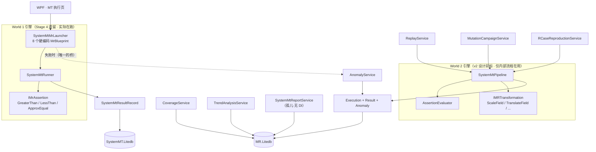
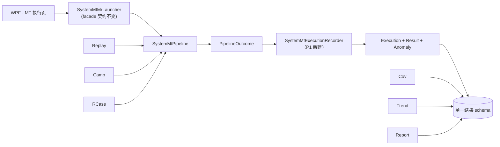
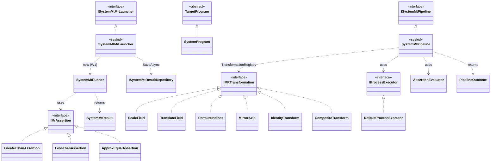
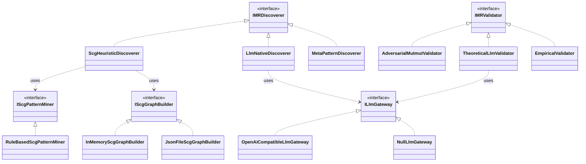
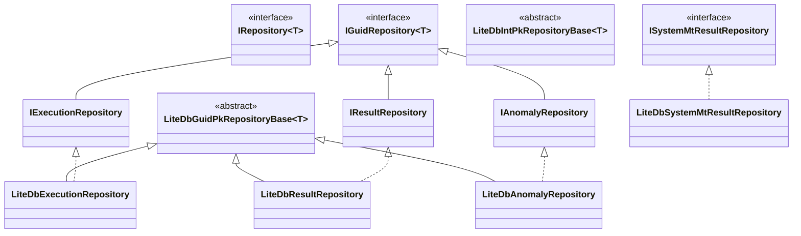

# System-MT 执行引擎统一计划

## 1. 背景与根因

v2 设计文档（`docs/design/v2-system-mt-architecture.md`）规定 System-MT 为**单一体系**：
一条 `SystemMtPipeline`、一套 `Execution+Result+Anomaly`（3NF）、一个数据驱动 MR 模型。
`migration-plan.md` P4 明文要求「删除既有 `IMrAssertion`/`GreaterThanAssertion`/
`LessThanAssertion`」、launcher 硬编码 scenarios「转数据驱动」。

**实代码核实结果：v2 迁移只做了一半。**

- ✅ 建新世界：`SystemMtPipeline` / `AssertionEvaluator` / `Execution-Result-Anomaly` /
  Discovery / Mutation / Coverage / Trend 全部落地。
- ❌ 退旧世界 + 搭桥：从未做。
  - `SystemMtMrLauncher`（WPF「MT 执行页」唯一入口）不引用 `SystemMtPipeline`、不写
    `Execution` —— 仍是 Stage 4 的 World 1（`SystemMtMrLauncher.cs:122/130` 直接 `new
    SystemMtRunner(...)`）。
  - migration-plan 列出的桥接脚本 `migrate_systemmtresult_to_v2` 未写（`tools/` 仅
    `migrate_mutations_to_v2.py` / `migrate_python_scenarios_to_v2.py` /
    `migrate_real_bugs_to_v2.py` 三个数据播种脚本）。
  - P4 要删的 `IMrAssertion` 至今健在，且新增了 `ApproxEqualAssertion`。

**根因一句话**：v2 迁移建好新引擎却没拆旧引擎、没搭桥；此后所有新功能在两套引擎上
各长各的。后果：用户从 MT 执行页跑的每次 MR 落在 World 1（`SystemMT.Litedb`），而
Coverage / Trend / Reporting 只读 World 2（`MR.Litedb`）—— 执行半边与分析半边跑在
互不相通的数据存储上。

## 2. 架构图（现状 · 双体系）

> 断裂点：`MT 执行页 → World 1 → SystemMT.Litedb`，而 `Coverage/Trend/Report →
> MR.Litedb`。两条数据流只在「失败 → AnomalyService」处擦肩。

### 目标架构（统一后）

## 3. 类图（继承 / 实现关系）

### 3.1 执行引擎（World 1 + World 2）

### 3.2 Discovery 子系统（T4）

> `ScgHeuristicDiscoverer` / `*ScgGraphBuilder` / `RuleBasedScgPatternMiner` /
> `OpenAiCompatibleLlmGateway` / `MultiLlmConsensusValidator` 均**未接 DI**，仅测试可达。

### 3.3 DAL 仓储家族

> 两条并行基类树（int PK / Guid PK），无共同父类。`ISystemMtResultRepository` /
> `LiteDbSystemMtResultRepository` 是 World 1 独立一支，不属 v2 仓储家族。

## 4. 核心功能 ↔ 实现类 归属表

| 核心功能 | 主实现类 | 归属 | 状态 |
|---|---|---|---|
| **T0** MT 执行流程 | W1: `SystemMtMrLauncher`→`SystemMtRunner`→`IMrAssertion` W2: `SystemMtPipeline`→`AssertionEvaluator`→`IMRTransformation` | 双 | ⚠️ 双实现未统一 |
| **T1** SUT 运行适配 | `CliProgramRunner` · `IProcessExecutor`/`DefaultProcessExecutor` · `PythonInput/OutputAdapter` | 跨 | ✅ |
| **T1** I/O 文件适配 | per-SUT Python adapter（`<sut>_input_adapter*.py` / `_output_adapter.py`） | W1 | ✅ |
| **T1** 差分测试 | cross-program `.feature`（OpenMOC × OpenMC） | W1 | ◐ 未按程序类型泛化 |
| **T1** CRUD | `Application/Domain/MetamorphicRelation` Repo + 21 v2 Repo | — | ✅ |
| **T2** 可视化/报表 | `MTVisualizationService` · 4 端报表生成器 · `HtmlSystemMtResultReportRenderer` | — | ✅ |
| **T2** 5-scope 报表 | `SystemMtReportService` | W2 | ✗ 孤儿（无 DI、无调用方） |
| **T3** 覆盖 | `CoverageService`（4 维） | W2 | ◐ 框架在，读不到 launcher 执行 |
| **T4** MR 识别 | `MetaPatternDiscoverer`·`LlmNativeDiscoverer`（接 DI）；`ScgHeuristicDiscoverer`·`MultiLlmConsensusValidator`（孤儿） | — | ◐ 3 路线接 ~1.5 |
| **T5** 异常 | `AnomalyService`（写 v2 `Anomaly`，launcher 失败时桥接） | W2(+W1桥) | ✅ 唯一打通处 |
| **T6** 变异 | `MutationCampaignService`→`SystemMtPipeline` | W2 | ✅ campaign；高级特性未做 |

## 5. 核心功能完成度评估

> 估值为本次审计判断，非精确度量。「功能可用」= 端到端能跑；「架构对齐」= 与 v2 设计一致。

| 功能 | 功能可用 | 架构对齐 | 主要缺口 |
|---|---|---|---|
| T0 | ~85% | **0%** | 双引擎并存；launcher 不写 `Execution/Result`；分析层看不到执行 |
| T1 | ~90% | ~80% | 差分测试未按 Num/MC/Surr/PINN 泛化 |
| T2 | ~80% | ~60% | `SystemMtReportService` 孤儿 |
| T3 | ~50% | ~50% | `CoverageService` 读 `MR.Litedb`，launcher 执行不入该库 |
| T4 | ~50% | ~50% | 3 识别路线仅 ~1.5 接入 app；SCG 路线全孤儿 |
| T5 | ~85% | ~80% | `AnomalyService` 用 `recordId` string 链 W1，未链 `Result` Guid |
| T6 | ~60% | ~75% | 语义/句法变异分型、等价变异体识别、最小完备子集未做 |

**最弱环是 T0 的架构对齐（0%）**——它被 T2/T3/T5/T6 全部下游依赖，是地基。

## 6. 依赖优先级

按「被其他模块/类依赖程度」排序（P0 最高）：

| 优先级 | 项 | 依赖它的模块 | 理由 |
|---|---|---|---|
| **P0** | `Execution/Result/Anomaly` 结果 schema 的统一写入口 | Coverage·Trend·Reporting·Replay·RCaseRepro·Anomaly | 全分析层依赖此 schema；当前无统一写入口、launcher 不写 |
| **P1** | launcher 路由到 `SystemMtPipeline` | WPF MT 执行页·批量执行 | 主用户入口；不统一则地基裂缝持续 |
| **P2** | 退役 World 1 内核（`SystemMtRunner`/`IMrAssertion`/`MrTransformation`） | 无（退役后） | 消除双实现，完成 migration-plan P4 |
| **P3** | 收口孤儿（`SystemMtReportService`·SCG 路线） | T2·T4 | 低依赖但价值未释放 |
| **P4** | 文档对齐（design docs / CLAUDE.md / PROJECT-STRUCTURE.md / AGENTS.md） | 全体阅读者 | 收尾，使图与实一致 |

## 7. 实现计划（TDD）

每个 phase 独立 PR、独立过 CI、可回滚。全部在 `MetBench_BLL.Core` / `MetBench_DAL` /
`MetBench_SystemMT.Tests`（cloud 可编译）；`ISystemMtMrLauncher` facade 契约
（`MrSummary`/`MrRunResult`）保持不变 → WPF 零改动。

### Phase 1 — 结果落库统一原语 `SystemMtExecutionRecorder`【本轮 TDD 启动】

`SystemMtPipeline.ExecuteAsync` 返回 `PipelineOutcome` 但**自身不持久化**。新建
`SystemMtExecutionRecorder`：把一次 `PipelineOutcome` 投影并持久化为 `Execution` +
`Result`（断言跑到时）。这是 v2 结果 schema 的**唯一写入口**。

- 新文件 `MetBench_BLL.Core/SystemMT/Pipeline/SystemMtExecutionRecorder.cs`
- 构造注入 `IExecutionRepository` / `IResultRepository`
- `Record(PipelineContext, PipelineOutcome, int mrInstanceId, Guid? batchId)` → `RecordedExecution(Guid ExecutionId, Guid? ResultId)`
- 状态映射：`PipelineOutcome.FinalStatus` → `Execution.Status`；`ok/anomaly` 写 `Result`，`error/timeout/cancelled` 仅写 `Execution`（含 `ErrorMessage`）
- 版本三元组 + `TriggeredBy` 从 `PipelineContext` 拷入 `Execution`

### Phase 2 — 6 个 launcher SUT 的 pipeline 兼容 parser

launcher 6 SUT 用 per-MR `*_input_adapter.py`（W1 模式）；pipeline 要通用
`input_parser.py`（parse/write）+ C# `IMRTransformation`。8 个 MR 全是「按 factor 缩放
某字段」→ 复用既有 `ScaleField`。为每个 MR 定义 `TargetFieldPath`。Python contract 测试。

### Phase 3 — launcher 路由到 pipeline

`MrBlueprint`→`PipelineContext` 映射；`SystemMtMrLauncher.RunAsync` 改调
`SystemMtPipeline.ExecuteAsync` + `SystemMtExecutionRecorder`；`MrRunResult` 从
`Execution/Result` 投影。`SystemMtRunner` 调用点移除。

### Phase 4 — 退役 World 1 内核 + 异常桥统一

删 `SystemMtRunner`/`IMrAssertion` 家族/`MrTransformation`/`SystemMtTask`/`SystemMtCase`/
`SystemMtResult`；`AnomalyService` 改链 `Result` Guid；`SystemMtResultRecord` 决策（降级
为只读 UI 投影 或 删除并归并 `SystemMT.Litedb`）。至此 migration-plan P4 真正完成。

### Phase 5 — 收口 + 文档对齐

`SystemMtReportService` 接 DI；SCG 路线接 DI 或显式标 experimental；design docs 走 RFC
更新；CLAUDE.md / PROJECT-STRUCTURE.md / AGENTS.md 对齐统一后架构。

## 8. 验收标准

| Phase | 验收标准 |
|---|---|
| P1 | `SystemMtExecutionRecorder` ≥ 5 个 TDD 测试全过：ok/anomaly/error 三态正确投影；`Execution↔Result` FK 一致；版本三元组拷贝正确；error 态不写 `Result`。CI 全绿。 |
| P2 | 6 SUT 各有通用 `input_parser.py` + contract 测试；`<sut>_input_parser parse/write` round-trip 测试过。 |
| P3 | launcher 经 pipeline 跑一个 MR，`MR.Litedb` 出现 `Execution`+`Result` 行；`ISystemMtMrLauncher` 既有测试全过（契约不变）；`SystemMtRunner` 无生产调用方。 |
| P4 | `IMrAssertion` 及实现、`SystemMtRunner` 删除后 `dotnet build MetBench_BLL.Core` + `dotnet test` 全绿；`AnomalyService` 链 `Result` Guid 的回归测试过。 |
| P5 | `SystemMtReportService` 有 DI 注册或显式判定删除；4 份文档无与代码相左的陈述。 |

## 9. TDD 启动记录（P1）

- 2026-05-22：P1 红→绿（见同日 commit）。
</content>
</invoke>
