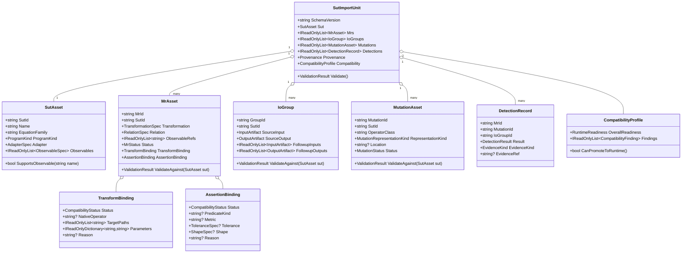

# Minimum-MR-SubSet A-Group Import/Export Design

> Status: design record for the first controlled import/export version.
> Scope: A group only, composed of P5 point kinetics, P4 pendulum, and P9 OpenMC surrogate.
> Evidence basis: local read-only clone of `https://github.com/meng004/Minimum-MR-SubSet.git` at commit `b931b5f74d0f3f3cb704cd6fedbcb4f523cccd7f`.

## 1. Discussion Record

The discussion moved through these decisions:

1. The first idea was to import PUT assets from `minimum-mr-subset` with P5 first and P8 second.
2. That was narrowed after review: MetBench should have one import/export model, not separate models for P5, P8, or each SUT.
3. `permission` was corrected to mean code access modifiers (`public`, `internal`, `private`), not business authorization.
4. The import unit was narrowed further: one package imports exactly one SUT, with multiple MRs, multiple input/output groups, multiple mutations, and detection evidence under that single SUT.
5. Because all ten PUTs cannot be designed safely in one pass, the first version imports only A group: P5, P4, and P9.

This record is intentionally conservative: import/export is treated as asset management, while runtime execution remains a separate compatibility-promotion step.

## 2. Evidence

Observed files in the external source repository:

- `experiments/puts/p5_pke.py`: returns `put_id = P5`, family `stiff ODE / point kinetics`, observables `t`, `power`, `precursor`, `power_extrema`.
- `experiments/puts/p4_pendulum.py`: returns `put_id = P4`, family `Hamiltonian ODE / symplectic Verlet`, observables `q`, `p`, `energy`.
- `experiments/puts/p9_openmc.py`: returns `put_id = P9`, family `Monte Carlo transport / OpenMC surrogate smoke`, observables `k_eff`, `sigma_k`, `reaction_balance`. The file explicitly states this is a deterministic two-group surrogate and that full OpenMC container execution is deferred.
- `tests/puts/test_smoke.py`: lists P1-P10 and asserts each `run_canonical()` returns a dictionary with `put_id`, `family`, non-empty `observables`, finite values, and runtime under 60 seconds.
- `scripts/llm/multi_llm_pipeline.py`: writes per-PUT `mrs.json`, `layer2_ratings.json`, `layer3_arbitration.json`, and `detection_matrix.csv`; detection rows use `mr_id`, `operator_class`, `detected`, and `mutator`.

Local execution limitation:

- `rtk python3 -m pytest tests/puts/test_smoke.py` in `/private/tmp/minimum-mr-subset` failed because `pytest` was not installed.
- Directly importing the ten PUT modules with system Python failed because `numpy` was not installed.
- Therefore this design does not claim the external PUTs were executed locally in this session. It relies on source inspection and the external repository's test contract.

## 3. Design Goals

1. Import one SUT at a time as a closed object graph.
2. Preserve multiple MRs, multiple input/output groups, multiple mutations, detection evidence, and provenance for that SUT.
3. Prevent imported assets from changing live System-MT catalog inventory until compatibility is proven.
4. Make assertion and input-transform compatibility explicit, not implicit.
5. Keep the first version small enough to validate with A group before expanding to P8/P3/P10 or the PDE regression group.

## 4. Design Principles

- Single-SUT closure: every imported MR, IO group, mutation, and detection record must reference the one root SUT.
- Fail closed: unknown schema versions, missing provenance, unsafe paths, unknown observable references, and unsupported runtime bindings block import or promotion.
- Staged before runtime: import success means the package is structurally valid; it does not mean the MR can run in the System-MT launcher.
- Evidence separation: imported detection matrices are research evidence, not MetBench execution evidence.
- Surrogate honesty: P9 must be represented as an OpenMC surrogate, not as real OpenMC execution.
- Immutable assets: imported entities should expose `public get; init;` properties and read-only collections.

## 5. Formal Symbol System

The first-version import unit is:

```text
SutImportUnit U = <S, R, G, Mu, D, Pi, K>

S  = one SUT asset
R  = set of MR assets for S
G  = set of input/output groups for S
Mu = set of mutation assets or mutation operator classes for S
D  = detection relation over R x Mu x G
Pi = provenance
K  = compatibility profile
```

SUT:

```text
S = <sid, name, equation_family, program_kind, adapter, input_schema, output_schema, observables>
```

MR:

```text
r in R =
<rid, sid, transform_spec, relation_spec, observable_refs,
 preconditions, status, transform_binding, assertion_binding>
```

Input/output group:

```text
g in G =
<gid, sid, source_input, source_output,
 followup_inputs, followup_outputs, role, evidence>
```

Mutation:

```text
mu in Mu =
<mid, sid, operator_class, representation_kind, location, status>
```

Detection:

```text
d in D =
<rid, mid, gid, result, evidence_kind, evidence_ref>
```

Compatibility:

```text
K =
<overall_readiness, assertion_compatibility,
 transform_compatibility, observable_compatibility,
 runtime_readiness, findings>
```

Required closure rules:

```text
forall r in R: r.sid = S.sid
forall g in G: g.sid = S.sid
forall mu in Mu: mu.sid = S.sid
forall d in D:
  d.rid in R
  d.mid in Mu
  d.gid in G
```

## 6. First Batch Selection

| Group | SUTs | Decision | Reason |
|---|---|---|---|
| A | P5, P4, P9 | First version | Covers reactor-adjacent ODE, Hamiltonian invariant, and statistical/surrogate output without requiring complex fields. |
| B | P8, P3 | Later | Adds complex spectral fields and chaotic trajectory sensitivity; useful but likely to stress assertion and transform design. |
| C | P10 | Later | Adds learning/training outputs and deterministic training concerns. |
| D | P1, P2, P6, P7 | Later | Useful compatibility regression samples but overlaps with existing MetBench PDE coverage. |

## 7. A-Group Expected Compatibility

| SUT | Assertion compatibility | Transform compatibility | First-version policy |
|---|---|---|---|
| P5 | `power` and `precursor` can map to scalar or time-series predicates after metric selection. | Parameters such as `rho`, time span, and step count need explicit paths before runtime. | Import as staged; mark some MRs as runtime candidates only if bindings are explicit. |
| P4 | `energy` invariant can map to approximate equality. | Initial condition and step-count transforms are straightforward if exposed in input schema. | Best A-group candidate for runtime-readiness in a later promotion PR. |
| P9 | `k_eff` and `sigma_k` can map to variance/noise-aware style checks. | `particles` and `enrichment` transforms need parameter paths. | Import as surrogate only; no real OpenMC claim. |

## 8. Class Model



## 9. Code Access Modifiers

| Element | Access |
|---|---|
| Domain records and enums | `public sealed record` / `public enum` |
| Entity properties | `public get; init;` |
| Collections | `IReadOnlyList<T>` / `IReadOnlyDictionary<TKey,TValue>` |
| Entity helper methods such as `SupportsObservable` | `public` |
| Importer/exporter entry points | `public` |
| JSON read/write helpers and path traversal checks | `private`, or `internal` only when tests require direct coverage |
| Injected service fields | `private readonly` |

## 10. Known Problems And Responses

| Problem | Risk | Response |
|---|---|---|
| Natural-language MR cannot map to typed assertion. | Imported MR is mistaken for executable MR. | Default MR readiness is `ImportedOnly`; runtime promotion requires explicit `AssertionBinding`. |
| Transform expression cannot map to existing transform operator. | Follow-up input cannot be generated. | Use `TransformBinding.Status = RequiresAdapter` or `Unsupported`; do not promote. |
| Mutation data may only identify operator class. | Concrete mutant kill rate is overstated. | `MutationRepresentationKind` distinguishes `OperatorClassOnly` from `ConcreteMutant`. |
| P9 is a surrogate. | Users may treat it as real OpenMC. | `ProgramKind = Surrogate`; provenance and display text must retain "OpenMC surrogate smoke". |
| Imported detection matrix may be confused with MetBench execution evidence. | Reports mix research evidence with actual runs. | `EvidenceKind = ImportedResearchEvidence`; never write it to execution-evidence repositories. |

## 11. Validation Results Required For Implementation

The implementation PR chain must report, without inference:

- The exact external repository URL and commit used for fixture generation.
- The exact source files read for P5, P4, and P9.
- Whether external `run_canonical()` smoke was executed; if not, the exact missing dependency or blocker.
- Focused import/export tests for each of P5, P4, and P9.
- Boundary tests proving no live System-MT catalog count changes during staged import.
- Compatibility-profile tests showing imported MRs default to non-runtime unless transform and assertion bindings are explicit.
