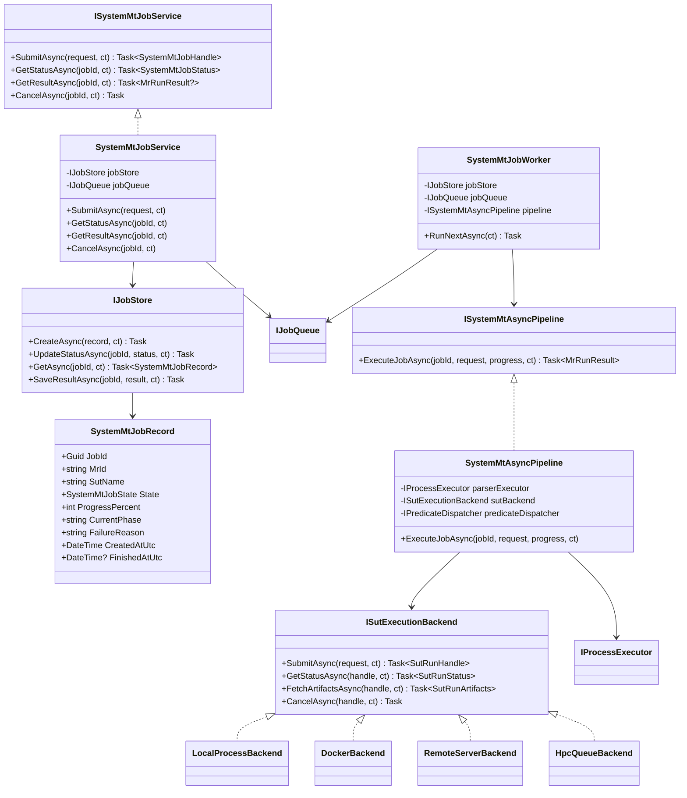

# System MT Async Execution + Polling Design

> Date: 2026-06-03
> Status: Proposed design, not implemented
> Scope: System MT long-running SUT execution, especially OpenMC-like programs with heavy dependencies, Docker or remote execution environments, and long wall-clock runtime.

## 1. Problem

Current MetBench System MT execution is intentionally simple: `SystemMtLauncher` builds a `PipelineContext`, and `SystemMtPipeline` runs parser, transformation, writer, source SUT, follow-up SUT, output parser, and assertion in one awaited call. This works for pure-stdlib SUTs and for local OpenMOC/OpenMC developer environments, but it is not enough for long-running or resource-heavy programs that may need Docker, a remote server, an HPC queue, or a dedicated OpenMC environment.

The goal of this design is to add an asynchronous execution abstraction with polling-based status retrieval without changing MR semantics, typed predicates, catalog meanings, or existing synchronous launcher behavior.

## 2. Existing Evidence and Boundaries

- `LauncherOptions.RuntimePythons` already supports manifest-driven runtime families such as `openmc`, `scipy`, and future keys without adding one field per runtime.
- `SUT/openmc/catalog.json` already declares `python_executable_kind: "openmc"` and per-MR `timeout_seconds: 300`.
- OpenMC tests are environment-gated and skip cleanly when the configured runtime is unavailable.
- `SystemMtPipeline` currently calls `IProcessExecutor.RunAsync(...)` for parser/adapter/SUT subprocesses and awaits completion.
- CI intentionally does not install OpenMC/OpenMOC; heavy runtime availability is an environment concern, not a CI baseline requirement.

These facts mean the new design should extend the execution boundary, not the MR/assertion/catalog semantic boundary.

## 3. Design Principles

1. Preserve the current synchronous launcher path.
2. Put asynchronous behavior around System MT execution, not inside MR definitions.
3. Use polling as the first-version status mechanism.
4. Keep hooks/webhooks out of v1; they may be added later as status-change accelerators, but final truth must still come from `GetStatusAsync(jobId)` and artifacts.
5. Treat Docker, local process, SSH, and HPC queue as execution backends behind one interface.
6. Fail closed when a backend cannot report final status or cannot provide required artifacts.
7. Keep cloud/Linux work in `MetBench_BLL.Core/` and tests; WPF consumption can be VM-side follow-up.

## 4. Recommended Architecture

Add a job layer above the existing launcher/pipeline. A caller submits an MR run and receives a `JobId` immediately. A worker executes the job in the background and records state changes. UI, CLI, tests, or a future service endpoint poll the job store by `JobId`.

The current `SystemMtLauncher.RunAsync()` remains the compatibility path for short or local runs. The new `ISystemMtJobService` offers asynchronous MR-level execution for long-running SUTs.

Status polling reads only the job store. It must not inspect local processes, Docker containers, remote servers, or queue systems directly. Backends are responsible for translating their native status into MetBench job states.

## 5. Class Diagram



## 6. State Model

```text
Queued
  -> Preparing
  -> RunningSource
  -> RunningFollowup
  -> ParsingOutputs
  -> Asserting
  -> Succeeded

Any non-terminal state may transition to:
  Failed
  TimedOut
  Cancelled
  ArtifactMissing
```

State meanings:

| State | Meaning |
|---|---|
| `Queued` | Job accepted and persisted, but no worker has started it. |
| `Preparing` | Work directory, source/follow-up inputs, backend request, or container/remote staging is being prepared. |
| `RunningSource` | Source-side SUT run has been submitted or is executing. |
| `RunningFollowup` | Follow-up-side SUT run has been submitted or is executing. |
| `ParsingOutputs` | Required output artifacts exist and are being parsed. |
| `Asserting` | Typed predicate / assertion evaluation is running. |
| `Succeeded` | MR completed and produced a final `MrRunResult`. |
| `Failed` | Backend, parser, transformation, assertion, or persistence failed with an explicit reason. |
| `TimedOut` | The job or one of its SUT runs exceeded its timeout policy. |
| `Cancelled` | User or system cancellation was accepted. |
| `ArtifactMissing` | Backend reported completion but required output artifacts could not be fetched or parsed. |

## 7. Polling Contract

Polling is the only status retrieval mechanism in v1:

```csharp
Task<SystemMtJobStatus> GetStatusAsync(Guid jobId, CancellationToken ct);
```

`GetStatusAsync` returns a snapshot from `IJobStore`, not from a live backend. The snapshot should include:

- `JobId`
- `MrId`
- `SutName`
- `State`
- `CurrentPhase`
- `ProgressPercent`
- `CreatedAtUtc`
- `UpdatedAtUtc`
- `FinishedAtUtc`
- `FailureReason`
- optional backend display fields: backend kind, external id, last poll time

Recommended polling interval:

- local/Docker developer execution: 1-2 seconds
- remote server or HPC queue: 5-15 seconds
- WPF UI should allow manual refresh and should not block the dispatcher thread

## 8. Backend Contract

`ISutExecutionBackend` hides execution environment differences:

```csharp
public interface ISutExecutionBackend
{
    Task<SutRunHandle> SubmitAsync(SutExecutionRequest request, CancellationToken ct);
    Task<SutRunStatus> GetStatusAsync(SutRunHandle handle, CancellationToken ct);
    Task<SutRunArtifacts> FetchArtifactsAsync(SutRunHandle handle, CancellationToken ct);
    Task CancelAsync(SutRunHandle handle, CancellationToken ct);
}
```

Backend responsibilities:

- map native states to `SutRunStatus`
- preserve MetBench input/output artifact contract
- enforce or report timeout
- never return success until required output artifacts are available
- provide a stable external id for diagnostics

Candidate backend sequence:

1. `LocalProcessBackend`: wraps current subprocess execution and proves compatibility.
2. `DockerBackend`: runs existing SUT contract inside a container or wrapper.
3. `RemoteServerBackend`: submits via an external service or SSH-style wrapper.
4. `HpcQueueBackend`: maps queue states such as pending/running/completed/failed to MetBench states.

## 9. Manifest Extension

Do not change existing `python_executable_kind` semantics. Add optional execution metadata only when async execution is used:

```json
{
  "execution": {
    "mode": "sync-local | async-local | docker | remote | hpc",
    "backend_key": "openmc-docker",
    "poll_interval_seconds": 5,
    "job_timeout_seconds": 3600,
    "artifact_policy": "fetch-on-complete"
  }
}
```

If `execution` is missing, current synchronous behavior remains unchanged.

## 10. Error Handling

- Unknown backend key: fail closed before queueing.
- Backend cannot submit: `Failed`, with submit diagnostic.
- Backend stops reporting status: keep last known state and fail after backend status timeout.
- Backend says completed but output missing: `ArtifactMissing`, not `Succeeded`.
- User cancellation: call backend `CancelAsync`; if backend cannot cancel, mark failure reason explicitly.
- Assertion failure remains an MR result/anomaly path, not an infrastructure failure.

## 11. Testing Strategy

First implementation should be TDD and cloud-safe:

- fake backend that moves through Queued/Running/Succeeded deterministically
- fake backend that times out
- fake backend that completes with missing artifact
- job store persistence round trip
- polling returns last durable state without touching backend
- existing `SystemMtLauncher.RunAsync()` and current end-to-end tests remain green
- no OpenMC installation required for the async design tests

Docker/remote/HPC tests should be integration-gated and skipped cleanly unless explicitly configured.

## 12. Scope Boundaries

In scope for the first implementation plan:

- job service abstraction
- durable job state
- polling status API
- local/fake backend
- compatibility with current synchronous launcher

Out of scope for v1:

- WPF UI changes
- webhook/hook callbacks
- remote credentials management
- HPC scheduler-specific implementation
- changing typed semantic catalog predicates
- changing OpenMC scientific model or MR definitions

## 13. Recommendation

Implement the async layer as a small, additive System MT job subsystem. Polling should be the only v1 status mechanism because it is deterministic, easy to test, and works for local process, Docker, remote server, and HPC queue backends. Hook/webhook support should remain a later optimization, and even then hooks should only trigger an immediate status refresh; the durable job store and fetched artifacts must remain the source of truth.
