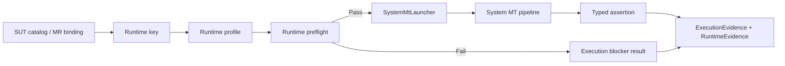

# System MT Runtime Environment Governance v1 Design

> Date: 2026-06-04
> Status: Accepted scoped design
> Scope: System MT runtime environment attribution, preflight gating, and evidence classification
> Source decision: user accepted the three-layer scheme and the recommended v1 boundary on 2026-06-04

## 1. Problem

MetBench now has live System MT launcher paths, a manifest-driven runtime key resolver, and an async job pipeline for long-running SUT work. However, SUT runtimes, dependency libraries, middleware, and external execution environments are still not first-class evidence objects.

This creates a real fault-attribution risk: when an SUT run fails, the system may not clearly distinguish whether the fault belongs to the runtime environment, dependency layer, external program startup, adapter, MetBench orchestration, or MR assertion semantics.

The v1 goal is not to support every execution backend immediately. The v1 goal is to make the runtime environment explicit, checkable, and recorded before expanding to Docker, remote servers, or HPC-style workloads.

## 2. Existing Anchors

The design must build on the current System MT surfaces instead of creating a parallel execution path:

- `LauncherOptions.RuntimePythons` and `LauncherOptions.ResolvePythonExecutable(...)` already provide manifest-driven runtime key resolution.
- `RuntimeEnvironmentResolutionException` already represents fail-closed runtime key resolution failures.
- `ManifestMrCatalogProvider` resolves SUT catalog manifests and runtime keys for live catalog projections.
- `SystemMtJobService -> SystemMtJobWorker -> SystemMtAsyncPipeline -> ISystemMtLauncher` is the current async execution path.
- `SystemMtExecutionRecorder` and `ExecutionEvidence` are the current evidence write surfaces.
- The async polling design already treats persisted job state as the source of truth and reserves Docker, remote, and HPC backends for later extension.

## 3. Accepted Three-Layer Scheme

### Layer 1: Runtime Capsule

Introduce a runtime profile as a first-class object. A profile is keyed by runtime key, not by SUT id alone.

Minimum v1 fields:

- `RuntimeKey`
- `DisplayName`
- `Kind`: local Python, virtual environment, container placeholder, remote placeholder, or HPC placeholder
- `ExecutablePath` or entrypoint command
- required import checks
- version commands
- required environment variables
- timeout policy
- resource hints
- artifact policy

For v1, the profile may be provided by in-process configuration and tests. It does not require a WPF editor, LiteDB persistence, Docker image management, or remote scheduler integration.

### Layer 2: Preflight Gate

Introduce a preflight service that resolves the runtime profile and checks that the required runtime can start before MR execution begins.

Minimum v1 checks:

- runtime key has a known profile
- executable path can be resolved
- configured version commands complete within timeout
- configured Python import checks complete within timeout
- required environment variables are present when declared

The preflight service must not install dependencies or silently repair environments. It only reports whether the environment is usable and records diagnostics.

Recommended insertion point: the launcher facade level, so synchronous launcher execution and async job execution share the same runtime gate.

### Layer 3: Failure Taxonomy And Evidence

Introduce a runtime-aware failure taxonomy and attach runtime evidence to execution evidence.

Minimum v1 failure categories:

- `None`
- `RuntimeProfileMissing`
- `RuntimeExecutableMissing`
- `DependencyMissing`
- `MiddlewareUnavailable`
- `PreflightFailed`
- `SutStartupFailure`
- `SutRuntimeFailure`
- `AdapterFailure`
- `MetBenchPipelineFailure`
- `AssertionFailure`
- `Timeout`
- `Cancelled`

Environment failures must not be recorded as MR anomalies. Assertion failures remain MR anomaly candidates. Runtime and dependency failures are execution blockers with separate evidence.

Minimum v1 evidence fields:

- runtime key
- runtime profile id or display name
- resolved executable path
- version command summaries
- dependency check summaries
- required environment variable names and pass/fail status
- failure category
- failure detail
- source root and source commit when explicitly known

## 4. v1 Boundary

Accepted v1 scope:

- Add runtime profile models.
- Add a preflight service and tests.
- Add runtime evidence and failure classification.
- Wire preflight into the live launcher path so async execution inherits the behavior.
- Keep the design fail-closed for unknown non-system runtime keys.
- Preserve current System MT typed catalog semantics and existing MR assertion behavior.

Explicit v1 non-goals:

- Do not implement Docker runtime execution.
- Do not implement remote server execution.
- Do not implement HPC scheduler integration.
- Do not add WPF runtime management UI.
- Do not auto-install Python packages, OS packages, OpenMC, OpenMOC, NumPy, SciPy, or pytest.
- Do not modify MR semantics, typed catalog predicates, or minimum-mr-subset P3/P8 MR logic.
- Do not claim external canonical source smoke unless the exact external runtime and dependencies actually ran.

## 5. Data Flow

## 6. Engineering Rules

- Preflight must be deterministic, bounded by timeout, and unit-testable with a fake process runner.
- Runtime profile resolution must fail closed for unknown non-system runtime keys.
- Preflight failures must produce machine-readable failure category and evidence.
- The async job worker must not duplicate runtime checks if the launcher facade already gates execution.
- The feature must not turn environment repair into runtime behavior.
- Documentation must distinguish MetBench-owned pure-stdlib runtime slices from external source canonical runs.

## 7. Evidence Expectations

An implementation PR for this design needs concrete evidence:

- focused runtime model and preflight tests
- failure-classification tests
- launcher integration tests
- async job integration tests proving preflight failures surface through polling state
- evidence serialization or recorder tests
- existing catalog boundary tests
- `git diff --check`

If .NET or external dependencies are unavailable in a local environment, the PR must state that limitation and avoid claiming those checks passed.
