# MetBench 操作指南（T0–T5 功能分层）

> 本指南面向 MetBench WPF 客户端使用者，按 **T0–T5 功能分层**（见 `CLAUDE.md` §2.2）逐层讲解操作步骤，图文并茂。
> 截图取自客户端**中文界面**（设置页可一键切换中/英文，见 §0）。客户端导航、设置及全部功能页面均已完成中英双语本地化。
>
> 功能分层速览：
> | 层 | 名称 | 入口页面 |
> |---|---|---|
> | **T0** | 系统级蜕变测试核心流程 | 系统级蜕变测试 |
> | **T1** | 操作入口与 CRUD（SUT/方程/样例/MR/历史、应用/领域/MR 管理） | 各目录页、各管理页、执行历史 |
> | **T2** | 可视化与报表（HTML/Word/Excel/PDF + 图表） | MR 报告生成、覆盖率仪表盘 |
> | **T3** | 覆盖度量 | 覆盖率仪表盘 |
> | **T4** | MR 识别（元模式/多 LLM/语义因果图） | 发现、候选评审、MR 检测、MR 推荐 |
> | **T5** | 异常调查与回放 | 异常、回放 |

---

## §0. 准备：启动与语言切换

1. 启动客户端 `MetBench_Client.exe`，主窗口标题为 **MetBench**。
2. 左侧为导航栏（图标 + 文字），底部为 **设置**。
3. 切换语言：进入 **设置** → **个性化** → **语言**，在下拉框选择「中文」或「English」，点击 **应用**。导航与各页面文字即时切换，无需重启。

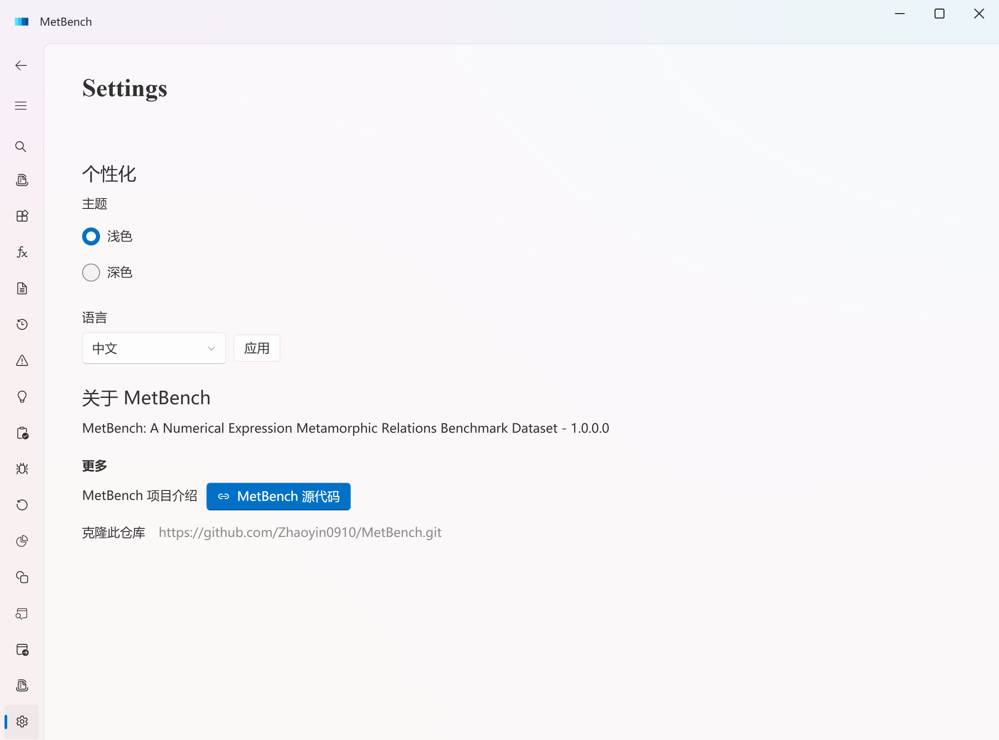

---

## §1. T0 · 系统级蜕变测试核心流程

**目标**：对一个被测程序（SUT）执行一次系统级蜕变测试——生成源输入 → 派生衍生输入 → 执行 SUT → 校验源/衍生输出是否满足蜕变关系（MR）。

**入口**：导航栏 → **系统级蜕变测试**。

**操作步骤**：
1. 在 **场景** 下拉框中选择一个 MR 场景（如 `1D advection — ScaleInitial (amplitude linearity)`）。下拉项对应 SUT × MR × 元模式的组合。
2. （可选）在 **变换因子** 输入框填写覆盖参数（如 `2`）；留空则用 MR 默认因子。
3. **描述** 区显示所选 MR 的蜕变关系说明（源/衍生关系、度量字段）。
4. 点击 **运行**。引擎依次完成：生成源输入 → 按 MR 派生衍生输入 → 调用 SUT → 提取度量 → 判定断言。
5. 运行结束后查看：
   - **最近结果**：本次度量值与断言结论；
   - **状态**：空闲 / 运行中 / 完成；
   - 下方 **结果表格**：每行一次运行，列含 运行时间 / 场景 / 断言 / 值 / **源输入** / **后续输入** / 是否通过。
6. 点击 **刷新最近记录** 重新加载历史运行；点击 **导出 HTML 报告** 生成报表（详见 §3 T2）。

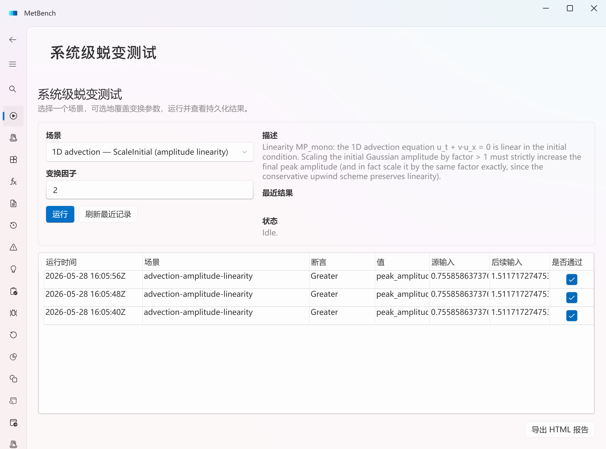

> 验收口径：流程端到端走通即为 T0 通过，不以覆盖全部方程为准（覆盖见 T3）。

---

## §2. T1 · 操作入口与 CRUD

T1 提供围绕 T0 的数据维护入口。所有目录页统一交互：左侧列表 + 右侧编辑表单，操作按钮为 **重新加载 / 新建 / 验证 / 保存 / 删除**。**保存前必须通过验证**（数据有效性校验，见 `CLAUDE.md` 行为约束 §7）。

### 2.1 系统级 MR 目录
**入口**：导航栏 → **系统级 MR 目录**。维护清单驱动的 MR 绑定。
1. 顶部 **清单** 下拉选择 manifest，点 **重新加载** 载入。
2. 左表选择一条 MR，或点 **新建 MR 草稿**。
3. 右侧表单填写：MR ID、显示名称、描述、变换、断言类型、断言名称、值名称、方程键、元模式、样例文件、工作根目录、超时秒数、变换因子、变换步骤、目标字段路径。
4. 点 **验证** 校验；通过后点 **保存**。
5. 选中 MR 后，右侧详情区顶部、编辑表单上方的 **蜕变关系说明** 卡片（只读）展示该 MR 的元模式依据、变换语义、观测量、判定谓词、容差、适用条件、违例含义；字段为空时显示「未填写」。

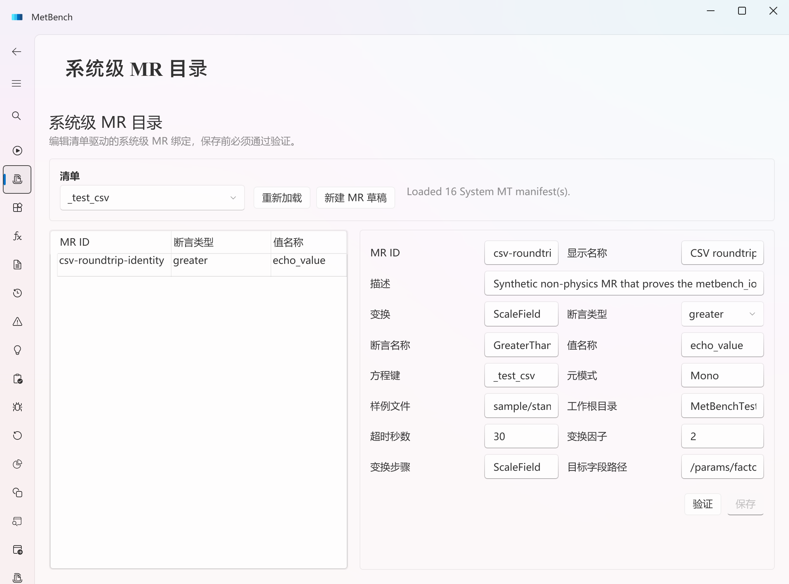

### 2.2 系统级 SUT 目录
**入口**：**系统级 SUT 目录**。编辑 `SUT/<sut>/catalog.json` 的程序段。
- 表单字段：SUT 名称、程序名称、方程、方程键、程序类型、Python 运行环境类型、运行脚本、输入/输出解析脚本、输入/输出适配脚本。流程同上（新建/验证/保存）。
- 选中 SUT 后，右侧详情区顶部、编辑表单上方的 **SUT 概况** 卡片（只读）展示该 SUT 的程序类型、求解方法、运行时标识、输入契约、输出契约、适配器、依赖风险；字段为空时显示「未填写」。

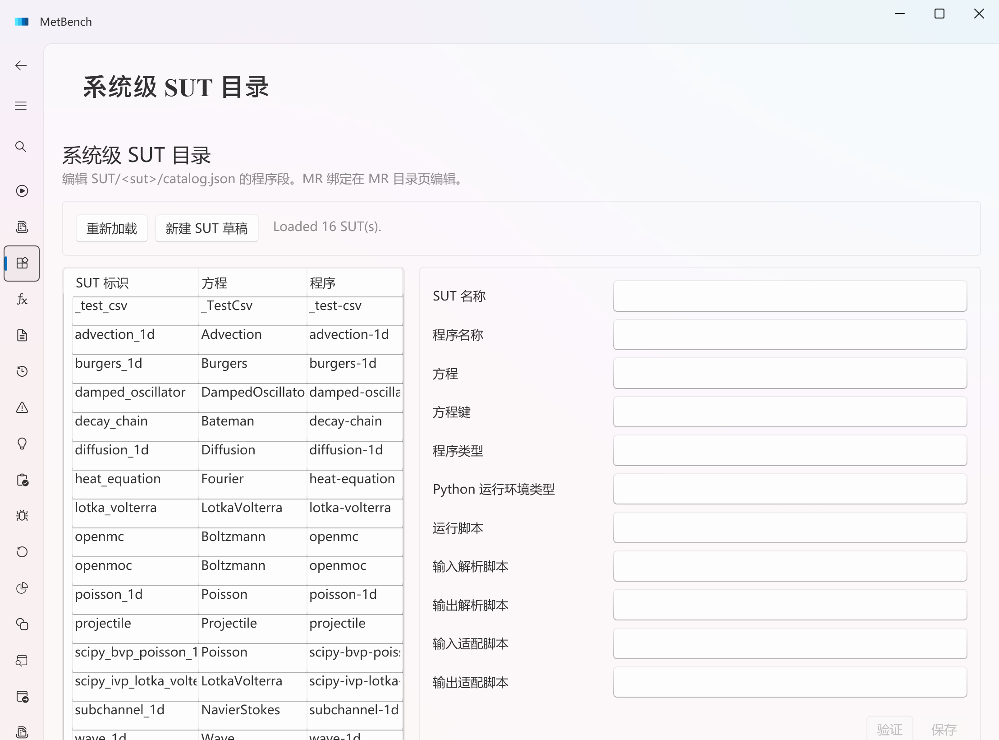

### 2.3 系统级方程目录
**入口**：**系统级方程目录**。内置种子方程只读；用户自定义方程可创建/编辑/删除（被 MR 引用者不可删）。
- 表单：方程键、名称、规范形式、符号系统。列表列：键 / 名称 / 规范形式 / 来源（内置或自定义）。
- 选中方程后，表单下方的 **方程说明** 卡片（只读）展示该方程的方程类别、方程族、主要变量、物理含义、基准选型理由、预期规律；内置种子方程会回填上述完整说明，字段为空时显示「未填写」。

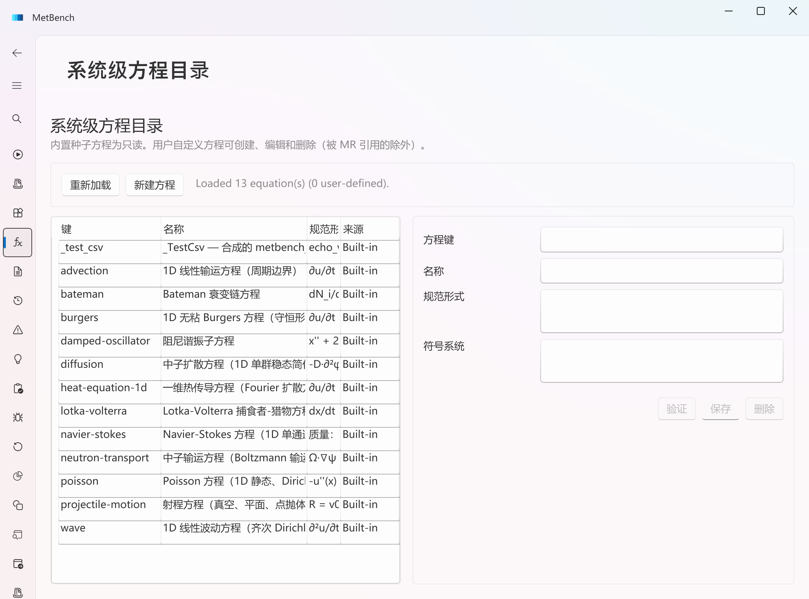

### 2.4 系统级样例目录
**入口**：**系统级样例目录**。浏览/编辑 `SUT/<sut>/sample/` 下样例 JSON。先选 **SUT**，再选样例文件编辑；被 MR 绑定引用的文件不可删。

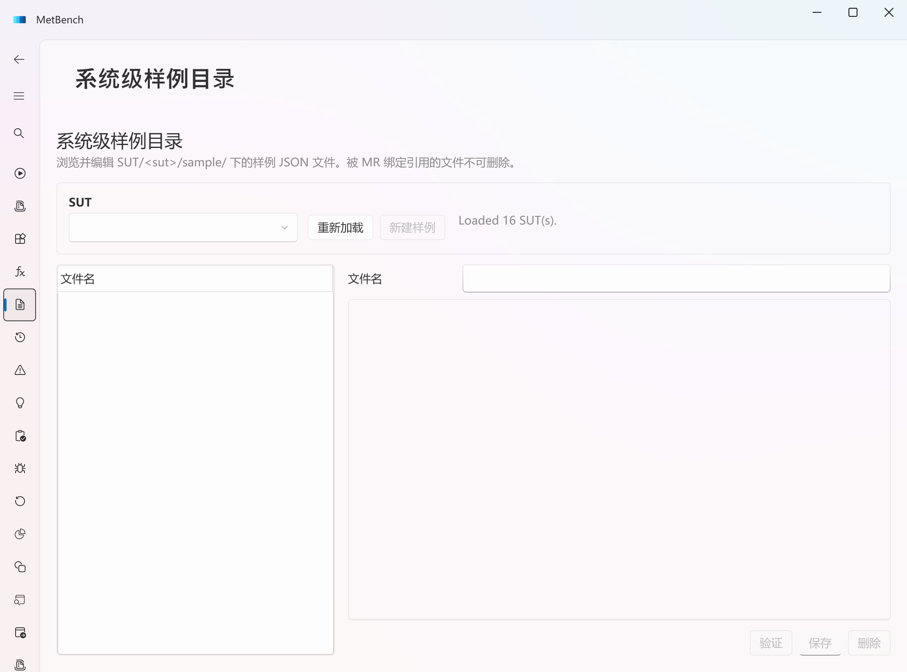

### 2.5 执行历史
**入口**：**系统级执行历史**。按时间浏览历次 System-MT 运行记录，支持查看与清理。选中一行后，右侧 **所选行证据** 文本区显示该次运行的执行 ID、记录时间与类型化校验明细；当该证据带有非空的样本对质量数据时，追加 **样本对质量** 区块：计划/执行/有效/通过/失败/跳过/非法规格计数，有效通过率与总通过率（不变区域百分比格式），以及跳过原因与非法规格原因分布。旧记录或样本对质量为默认空时，该区块不显示（保持安静）。

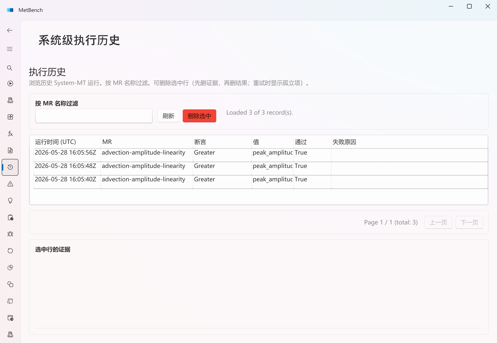

### 2.6 应用 / 领域 / MR 管理（方法级 CRUD）
**入口**：**应用管理 / 领域管理 / MR 管理 / MR 展示**。维护应用程序、领域、方法级 MR 等基础数据，操作为 **新增 / 修改 / 删除 / 查询**。

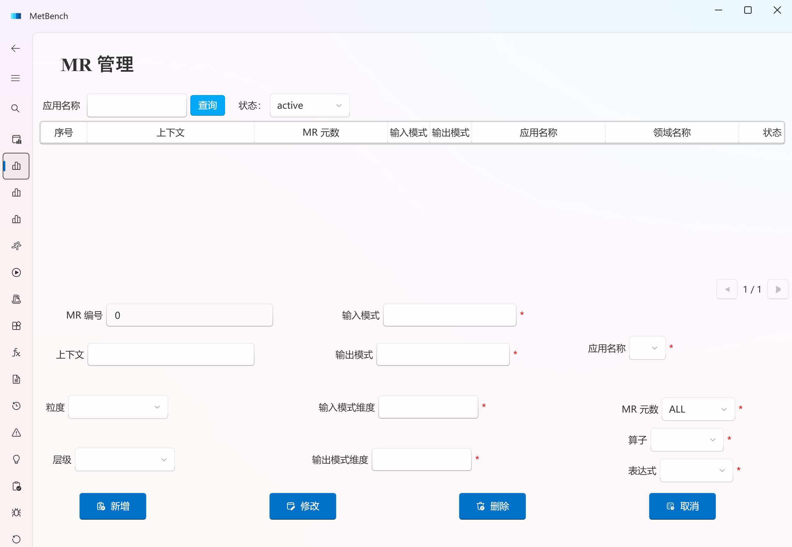

---

## §3. T2 · 可视化与报表

**目标**：把 System-MT 结果生成多端报告与图表。

**入口**：导航栏 → **MR 报告生成**（及各页的 **导出 HTML 报告** 按钮）。

**操作步骤**：
1. 选择要导出的运行结果 / 报告范围。
2. 点击 **导出**，选择目标格式：HTML / Word / Excel / PDF（四端渲染器）。
3. 报告含运行元数据、源/衍生输出、断言结论与图表投影。

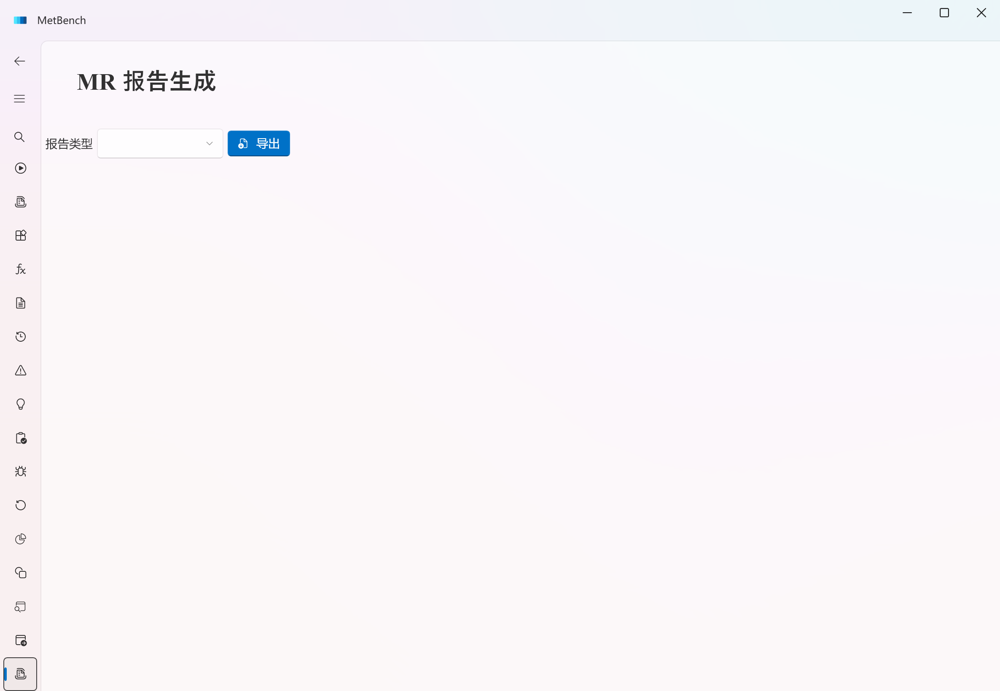

---

## §4. T3 · 覆盖度量

**目标**：统计方程 / SUT / MR / 元模式四维覆盖。

**入口**：导航栏 → **覆盖率**（覆盖率仪表盘）。

**操作步骤**：
1. 打开覆盖率仪表盘，查看各维度覆盖图（元模式覆盖、Bug 覆盖等）。
2. 反应堆物理 5 个核心方程（boltzmann / diffusion / bateman / fourier / NS）为优先锚定子集，可在图中核对其覆盖状态。

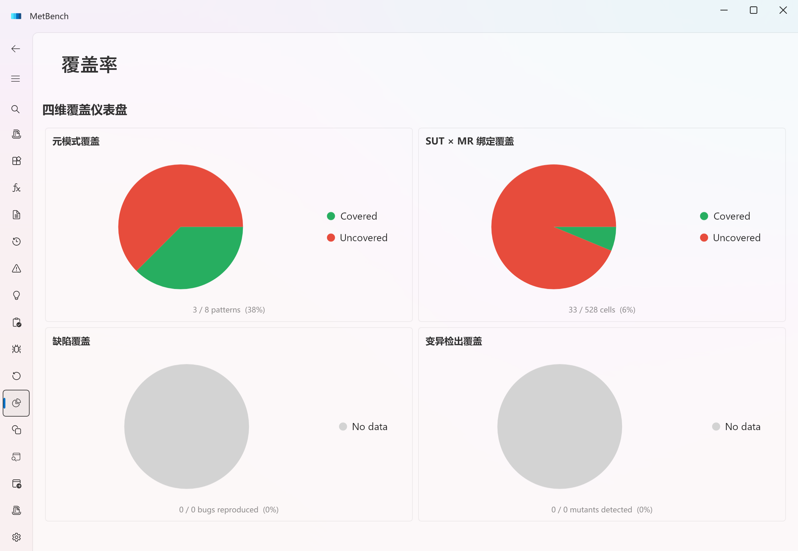

---

## §5. T4 · MR 识别

**目标**：在可插拔的 MR 发现框架下，从 SUT 的元信息/语义因果图自动发现候选 MR，并评审后入库。三条技术路线：元模式 meta-prompt、多 LLM 共识、语义因果图。

**入口**：导航栏 → **发现** → **候选评审**（以及 **MR 检测 / MR 推荐**）。

**操作步骤**：
1. 在 **发现** 页选择目标 SUT/方程，运行发现，生成候选 MR 草稿（状态区显示「发现进行中…」「完成 — 候选 N 个」等反馈）。

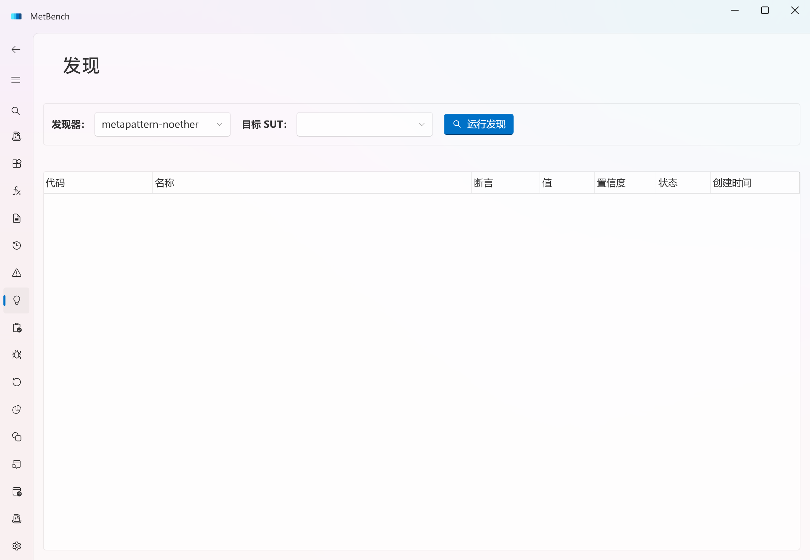

2. 进入 **候选评审** 页逐条评审候选：查看其变换/断言/度量，验证有效性。
3. 通过的候选绑定入 MR 目录（失败候选 fail-closed，不入库）。
4. **MR 推荐** 页给出基于度量的 MR 推荐；**MR 检测** 页执行自动识别。

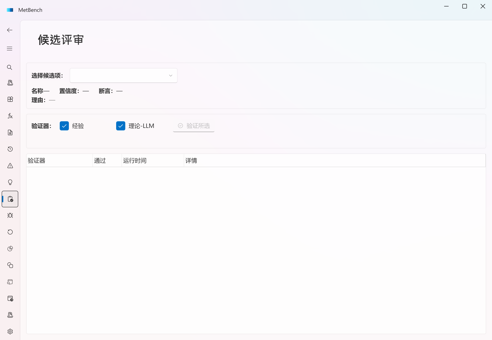

---

## §6. T5 · 异常调查与回放

**目标**：MT 检出的违例进入异常调查工作流（查询 / 过滤 / 状态机 / 共性分析）；确认缺陷封存入库，支持回放、定位、分类。

**入口**：导航栏 → **异常** 与 **回放**。

**操作步骤**：
1. **异常** 页浏览所有 MT 违例；按 严重程度 / 状态 过滤、查询。
2. 选择一条异常，在右侧选择目标状态，点 **应用状态转换** 推进异常状态机（如 新建 → 调查中 → 已确认 / 已驳回）。

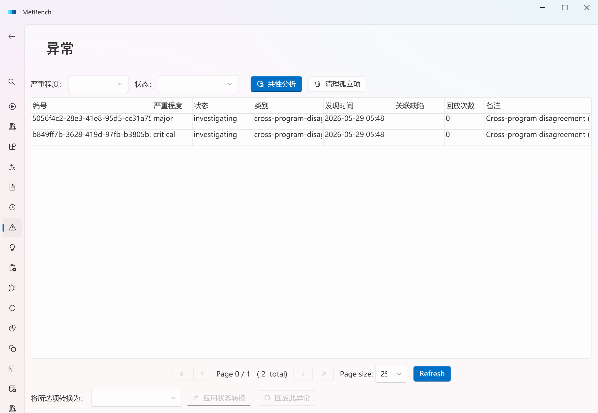

3. 进入 **回放** 页，对确认的异常按「程序版本 × MR × 测试输入」三元组回放，定位与分类。

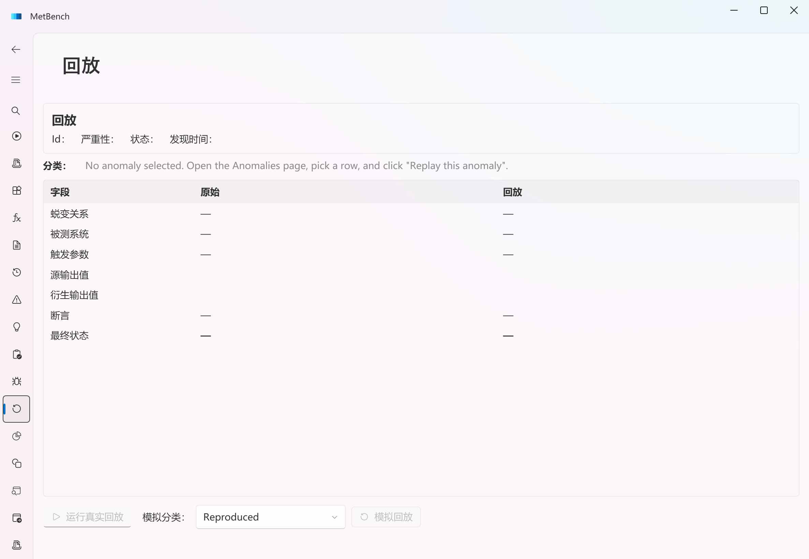

---

## 附录 A：T0–T5 与测试切片对照（发布冒烟）

| 层 | 操作要点 | 代表切片（SUT / MR / 元模式 / 度量） |
|---|---|---|
| T0/T1/T3 | 运行 System-MT 并持久化 | heat-equation / heat-equation-amplitude / Mono / max_u；advection-1d / advection-mesh-conservation / Inv / mass_integral；wave-1d / wave-mesh-energy-convergence / Conv / energy_proxy |
| T1 | MR/SUT/方程/样例/历史 CRUD | manifest 编辑器 + 各目录编辑器 |
| T2 | HTML/Word/Excel/PDF + 图表 | 四端渲染器 |
| T4 | 发现草稿绑定、非法候选 fail-closed | DiscoveredMrCatalogBinder |
| T5 | 异常状态机 + 回放 + 孤儿清理 | Anomaly 状态/持久化、ReplayService |

> 切片来源：`docs/superpowers/specs/2026-05-30-t0-t5-minimal-release-readiness-report.md`。

---

## 附录 B：本地化说明

- 界面文字（导航、标题、字段标签、按钮、表格列头、说明、状态提示）均存于 `.resx` 资源文件：`MetBench_UI.Localization/Resources/Strings.resx`（英文）与 `Strings.zh-CN.resx`（中文）。
- 新增/修改翻译：在两个 `.resx` 各加一条 `<data name="Key"><value>…</value></data>`，再在对应 XAML 绑定 `{Binding ViewModel.Localization[Key]}`（代码侧状态串用 `Localization["Key"]` 或 `string.Format(Localization["Key"], …)`）。切换语言即时刷新，无需重启。
- 图中数据值（MR id、SUT id、方程名、度量值等）为业务数据，按设计**不做翻译**。
